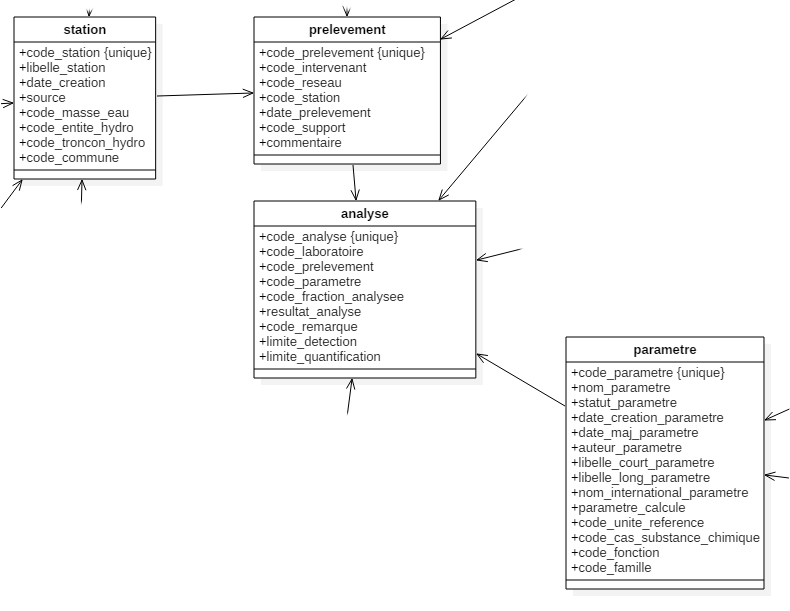
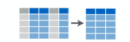
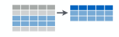
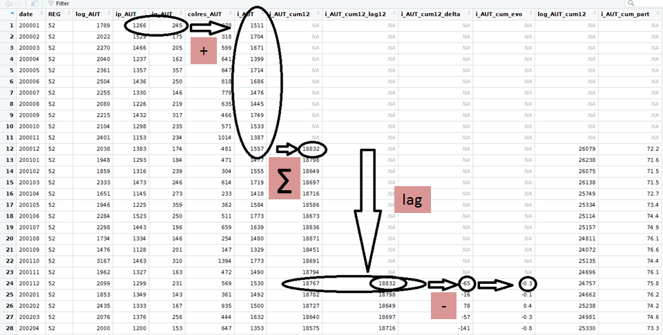
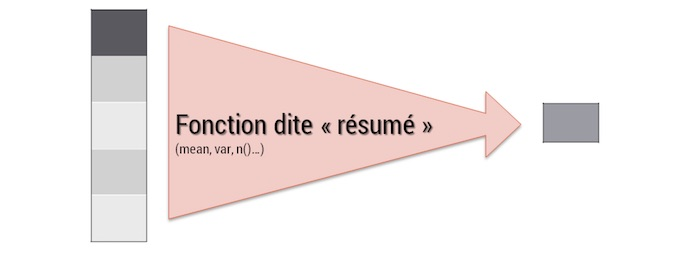
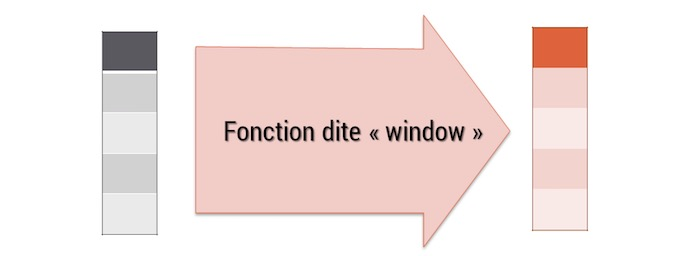
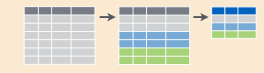
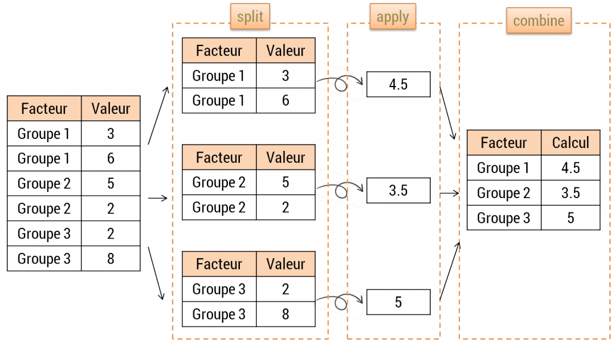

# Manipuler des données

## Les principes des fonctions de `{dplyr}`

Le but de `{dplyr}` est d'identifier et de rassembler dans un seul package les outils de manipulation de données les plus importantes pour l'analyse des données. Ce package rassemble donc des fonctions correspondant à un ensemble d'opérations élémentaires (ou *verbes*) qui permettent de : 

- Sélectionner un ensemble de variables : `select()`  
- Sélectionner un ensemble de lignes : `filter()`  
- Ajouter/modifier/renommer des variables : `mutate()` ou `rename()`  
- Produire des statistiques aggrégées sur les dimensions d'une table : `summarise()`  
- Trier une table : `arrange()`  
- Manipuler plusieurs tables : `left_join()`, `right_join()`, `full_join()`, `inner_join()`...  

D'appliquer cela sur des données, quel que soit leur format : data frames, data.table, base de données sql, big data...

D'appliquer cela en articulation avec `group_by()` qui change la façon d'interpréter chaque fonction : d'une interprétation *globale* sur l'ensemble d'une table, on passe alors à une approche *groupe par groupe* : chaque groupe étant défini par un ensemble des modalités des variables définies dans l'instruction `group_by()`.

## Présentation des données

On va travailler sur ce module principalement à partir des données sitadel en date réelle estimée (permis de construire) et à partir des données de qualité des eaux de surface.




## Chargement des données

```{r manip_1, echo = FALSE, warning = FALSE, error = FALSE, eval = FALSE}
drv <- dbDriver("PostgreSQL")
con <- dbConnect(drv, dbname = "production", host = "xx.xx.xxx.xxx", port = 5432,
                 user = "dreal", password = "xxxxxxxx")
postgresqlpqExec(con, "SET client_encoding = 'windows-1252'")

analyse <- dbGetQuery(con, "SELECT * FROM pesticides.analyse")
parametre <- dbGetQuery(con, "SELECT * FROM pesticides.parametre")
prelevement <- dbGetQuery(con, "SELECT * FROM pesticides.prelevement")
station <- st_read_db(con, query = "SELECT * FROM pesticides.station")
```

```{r manip_2, include = TRUE}
load(file = "data/FormationPreparationDesDonnees.RData")
```

## Les verbes clefs de `{dplyr}` pour manipuler une table

### Sélectionner des variables : `select()`
<center></center>

Nous allons ici sélectionner un ensemble de variables de la table des prélèvements.

```{r manip_3, warning = FALSE}
prelevementb <- select(
  prelevement, date_prelevement, code_prelevement,
  code_reseau, code_station
)
datatable(prelevementb)

prelevementb <- select(prelevement, -commentaire)
names(prelevementb)
```

`select()` possède ce qu'on appelle des [helpers](https://dplyr.tidyverse.org/reference/select.html) qui permettent de gagner du temps dans l'écriture de notre select. A partir du moment où les conventions de nommage sont correctement effectuées, cela permet de gagner également en reproductibilité d'une année sur l'autre.

Exemple : sélectionner toutes les variables qui commencent par "code_" : 

```{r manip_4}
prelevementb <- select(prelevement, starts_with("code_"))
```

Exemple : sélectionner les variables dont les noms sont contenus dans un vecteur de chaînes de caractères :

```{r manip_5}
mes_variables <- c("code_prelevement", "code_intervenant", "code_reseau", "date_prelevement")
prelevementb <- select(prelevement, one_of(mes_variables))
```

### Trier une table : `arrange()`

```{r  manip_6}
prelevementb <- arrange(prelevementb, date_prelevement)
```

### Renommer une variable : `rename()`

```{r  manip_7}
prelevementb <- rename(prelevementb, date_p = date_prelevement)
```

On peut aussi directement renommer une variable dans l'opération `select()`

```{r  manip_8}
prelevementb <- select(prelevement, date_p = date_prelevement, code_prelevement,
                       code_reseau, code_station)
```

### Filtrer une table : `filter()`
<center></center>

On va ici récupérer les analyses produites par l'ARS

```{r filtrer}
ars <- filter(prelevement, code_reseau == "ARS")
```

L'exemple ci-dessus n'exerce un filtre que sur une condition unique.

Pour des conditions cumulatives (toutes les conditions doivent être remplies), le "&" ou la ","

```{r manip_9}
ars <- filter(prelevement, code_reseau == "ARS", code_intervenant == "44")
```

Pour des conditions non cumulatives (au moins une des conditions doit être remplie), le "|"

```{r manip_10}
ars <- filter(prelevement, code_reseau == "ARS" | code_reseau == "FREDON")
```

Si une condition non cumulative s'applique sur une même variable, privilégier un test de sélection dans une liste avec le `%in%`

```{r manip_11}
ars <- filter(prelevement, code_reseau %in% c("ARS", "FREDON"))
```

Pour sélectionner des observations qui ne répondent pas à la condition, le `!` (la négation d'un test)

Toutes les observations ayant été réalisées par un autre réseau que l'ARS :

```{r manip_12a}
non_ars <- filter(prelevement, code_reseau != "ARS")
```

Toutes les observations ayant été réalisées par un autre réseau que l'ARS ou FREDON :

```{r manip_12b}
ni_ars_ni_fredon <- filter(prelevement, !(code_reseau %in% c("ARS", "FREDON")))
```

### Modifier/ajouter une variable : `mutate()`

`mutate()` est le verbe qui permet la transformation d’une variable existante ou la création d’une nouvelle variable dans le jeu de données. 

<center></center>

Création de nouvelles variables : 
```{r manip_13}
prelevementb <- mutate(prelevementb,
  code_prelevement_caract = as.character(code_prelevement),
  code_reseau_fact = as.factor(code_reseau)
)
```

Modification de variables existantes :
```{r manip_14}
prelevementb <- mutate(prelevementb,
  code_prelevement = as.character(code_prelevement),
  code_reseau = as.factor(code_reseau)
)
```


`mutate()` possède une variante, `transmute()`, qui fonctionne de la même façon, mais ne conserve que les variables modifiées ou créées par le verbe.

### Extraire un vecteur : `pull()`

`pull()` permet d'extraire sous forme de vecteur une variable d'un *dataframe.*

```{r manip_15}
stations_de_la_table_prelevement <- pull(prelevement, code_station)
stations_de_la_table_prelevement <- unique(stations_de_la_table_prelevement)
```

## La boîte à outils pour créer et modifier des variables avec R

### Manipuler des variables numériques

Vous pouvez utiliser beaucoup de fonctions pour créer des variables avec `mutate()` :

- les opérations arithmétiques : `+`,`-`,`*`,`/`,`^` ;

- arithmétique modulaire : `%/%` (division entière) et `%%` (le reste), où `x == y * (x %/% y) + (x %% y)` ;

- logarithmes : `log()`, `log2()`, `log10()` ; 

- navigations entre les lignes : `lead()` et `lag()` qui permettent d'avoir accès à la valeur suivante et précédente d'une variable.

```{r, echo = TRUE, eval=TRUE}

a <- data.frame(x=sample(1:10))

b <- mutate(a, lagx = lag(x),
               leadx = lead(x),
               lag2x = lag(x, n = 2),
               lead2x = lead(x, n = 2))
datatable(b)
```

- opérations cumulatives ou glissantes : 

    - R fournit des fonctions pour obtenir **opérations cumulatives** les somme, produit, minimum et maximum cumulés, dplyr fournit l'équivalent pour les moyennes : `cumsum()`, `cumprod()`, `cummin()`, `cummax()`, `cummean()`
  
    - Pour appliquer des **opérations glissantes**, on peut soit créer l'opération avec l'instruction `lag()`, soit exploiter le package `RcppRoll` qui permet d'exploiter des fonctions prédéfinies.

Exemple de somme glissante sur un pas de 2 observations.

```{r manip_16, eval=TRUE}

a <- data.frame(x = sample(1:10))

b <- mutate(a, cumsumx = cumsum(x),
               rollsumrx = roll_sumr(x, n = 2))
               
datatable(b)
```

Attention aux différences entre `roll_sum()` et `roll_sumr()`. Contrairement à `roll_sum()`, la fonction `roll_sumr()` fait en sorte d'obtenir un vecteur de même dimension que l'entrée :

```{r manip_17, eval=TRUE}
a$x
rollsumrx <- roll_sumr(a$x, n=2)
rollsumx <- roll_sum(a$x, n=2)
length(rollsumrx) == length(a$x)
length(rollsumx) == length(a$x)

```

Aussi dans le cadre d'opérations sur les dataframes, `roll_sum()` ne fonctionnera pas.

```{r manip_18, eval=FALSE}

b <- mutate(a, cumsumx = cumsum(x),
               rollsumx = roll_sum(x, n=2))

```


- Comparaisons logiques : `<`, `<=`, `>`, `>=`, `!=`

- Rangs : `min_rank()` devrait être la plus utile, il existe aussi notamment `row_number()`, `dense_rank()`, `percent_rank()`, `cume_dist()`, `ntile()`.

- `coalesce(x, y)` : permet de remplacer les valeurs manquantes de x par celle de y

- `variable = ifelse(condition(x), valeursioui, valeursinon)` permet d'affecter *valeursi* ou  *valeursinon* à *variable* en fonction du fait que *x* répond à *condition*.
Exemple : création d'une variable résultat pour savoir si les résultats de nos analyses sont bons, ou non.

```{r manip_19}
analyseb <- mutate(analyse, resultat_ok = ifelse(code_remarque %in% c(1, 2, 7, 10),
                                                 yes = TRUE, no = FALSE))
```

qui peut se résumer, lorsque `yes = TRUE` et `no = FALSE`, à :
```{r manip_19b}
analyseb <- mutate(analyse, resultat_ok = code_remarque %in% c(1, 2, 7, 10))
```


- `case_when()` permet d'étendre la logique de `ifelse()` à des cas plus complexes.
Les conditions mises dans un `case_when()` ne sont pas exclusives. De ce fait, il faut pouvoir déterminer l'ordre d'évaluation des conditions qui y sont posées. Cet ordre s'effectue de bas en haut, c'est à dire que la dernière condition évaluée (celle qui primera sur toutes les autres) sera la première à écrire.
Exemple: On va ici calculer des seuils fictifs sur les analyses.

```{r manip_20}
analyseb <- mutate(analyse, classe_resultat_analyse = case_when(
  resultat_analyse == 0     ~ "1",
  resultat_analyse <= 0.001 ~ "2",
  resultat_analyse <= 0.01  ~ "3",
  resultat_analyse <= 0.1   ~ "4",
  resultat_analyse > 0.1    ~ "5",
  TRUE                      ~ ""
  ))
```

### Exercice 1 : Les données mensuelles sitadel

cf. package d'exercices `{savoirfR}`

À partir du fichier sitadel de février 2017 (ROES_201702.xls), produire un dataframe `sit_52_ind` contenant pour la **région Pays-de-la-Loire** (code région 52), pour **chaque mois** et pour les **logements individuels** (definis par la somme des logements individuels purs et individuels groupés : `i_AUT = ip_AUT + ig_AUT`) :  

   - le cumul des autorisations sur 12 mois glissants (`i_AUT_cum12`) ;    
   
   - le taux d’évolution du cumul sur 12 mois (`i_AUT_cum_evo`, en %) ;   
   
   - la part de ce cumul dans celui de l’ensemble des logements autorisés (`log_AUT`, en %).    
   
   
<center></center>


### Manipuler des dates

Parmi l'ensemble des manipulations de variables, celle des dates et des heures est toujours une affaire complexe.  
Le framework tidyverse propose le package `{lubridate}` qui permet de gérer ces informations de façon cohérente.

- gestion des dates :

```{r manip_22, echo = TRUE, eval = TRUE, results = 'hide'}

dmy("jeudi 21 novembre 2020")
dmy("21112020")
ymd("20201121")
```

- gestion des dates/heures : 

```{r, echo = TRUE, eval = TRUE, results = 'hide'}
dmy_hms("mardi 21 novembre 2020 9:30:00")
now()
```

- combien de jours avant Noël ?

```{r, echo = TRUE, eval = TRUE, results = 'hide'}

annee_en_cours <- year(today())

prochain_noel <- paste("25 décembre", annee_en_cours)
prochain_noel

dmy(prochain_noel) - today()
```

- le jour de la semaine d'une date : 

```{r, echo = TRUE, eval = TRUE, results = 'hide'}
wday(dmy("19012038"), label = TRUE)
```

Les fonctions `make_date()` et `make_datetime()` vous permettent de transformer un ensemble de variables en un format date ou date - heure. C'est par exemple utile lorsque l'on a des variables séparées pour l'année, le mois et le jour.

#### Exercice 2 : les dates

Convertir les colonnes de la table exercice au format date (quand c'est pertinent).

### Manipuler des chaînes de caractères

Le package `{stringr}` compile l'ensemble des fonctions de manipulation de chaînes de caractère utiles sur ce type de données.

On peut diviser les manipulations de chaînes de caractères en 4 catégories : 

- manipulations des caractères eux-mêmes,  
- gestion des espaces,  
- opérations liées à la langue,  
- manipulations de "pattern", notamment des expressions régulières.

#### Manipulations sur les caractères

Obtenir la longueur d'une chaîne avec `str_length()` :

```{r}
library(stringr)
str_length("abc")
```

Extraire une chaîne de caractères avec `str_sub()`  

`str_sub()` prend 3 arguments : une chaîne de caractère, une position de début, une position de fin.
Les positions peuvent être positives, et dans ce cas, on compte à partir de la gauche, ou négatives, et dans ce cas on compte à partir de la droite.

```{r}
a <- data.frame(x = c(" libeatg", "delivo y"))
b <- mutate(a, pos3a4 = str_sub(string = x, start = 3, end = 4),
               pos3a2avtlafin = str_sub(string = x, start = 3, end = -2))
datatable(b)
```

`str_sub()` peut être utilisé pour remplacer un caractère

```{r}
str_sub(a$x, start = 6, end = 9) <-"rer"
a$x

```

Si on souhaite réaliser ce genre d'opération dans le cadre d'un `mutate`, il faut utiliser 
une fonction dite "pipe-operator-friendly", par exemple `stri_sub_replace()` du package `{stringi}`

```{r}
# install.packages("stringi")
library(stringi)

a <- data.frame(x = c(" libeatg", "delivo y"))
b <- mutate(a, y=stri_sub_replace(str=x, from=6, to=9, value = "rer"))
datatable(b)
```


#### Gestion des espaces

La fonction `str_pad()` permet de compléter une chaîne de caractère pour qu'elle atteigne une taille fixe. Le cas typique d'usage est la gestion des codes communes Insee.

```{r}
code_insee <- 1001
str_pad(code_insee, 5, pad = "0")
```

On peut choisir de compléter à gauche, à droite, et on peut choisir le "pad". Par défaut, celui-ci est l'espace.

La fonction inverse de `str_pad()` est `str_trim()` qui permet de supprimer les espaces aux extrémités de notre chaîne de caractères.

```{r}
proust <- "   Les paradoxes d'aujourd'hui sont les préjugés de demain.  "
str_trim(proust)
str_trim(proust, side = "left")
```

Les **expressions régulières** permettent la détection de "patterns" sur des chaînes de caractères. Par exemple "^" sert à indiquer que la chaîne de caractère recherchée doit se trouver au début de la chaîne examinée. Au contraire, "$" sert à indiquer que la chaîne de caractère recherchée doit se trouver à la fin.


```{r}

a <- data.frame(txt = c("vélo", "train", "voilier", "bus", "avion", "tram", "trottinette"))

b <- mutate(a, tr_au_debut = str_detect(string = txt, pattern = "^tr"))
b

filter(b, tr_au_debut)

filter(a, str_detect(string = txt, pattern = "n$"))

```


#### Opérations liées à la langue

Ces différentes fonctions ne donneront pas le même résultat en fonction de la langue par défaut utilisée.
La gestion des majuscules/minuscules :

```{r}
proust <- "Les paradoxes d'aujourd'hui sont LES préjugés de Demain."
str_to_upper(proust)
str_to_lower(proust)
str_to_title(proust)
```

La gestion de l'ordre, `str_sort()` et `str_order()` : 

```{r}
a <- data.frame(x = c("y", "i", "k"))

mutate(a, en_ordre = str_sort(x), 
          selon_position = str_order(x))

```

Suppression des accents (base::iconv) : 

```{r}
proust2 <- "Les paradoxes d'aujourd'hui sont les préjugés de demain ; et ça c'est embêtant"
iconv(proust2, to = "ASCII//TRANSLIT")

```

Avec un humour quelque peu discutable, un petit aide-mémoire illustré, assez visuel, est proposé par Lise Vaudor [ici](http://perso.ens-lyon.fr/lise.vaudor/manipuler-des-strings-avec-r/). 

### Manipuler des variables factorielles ( = qualitatives ou catégorielles)

Les facteurs (ou factors, an anglais) sont un type de vecteur géré nativement par R qui permettent de gérer les variables qualitatives ou catégorielles. Les facteurs sont souvent mis en regard des données labellisées utilisées dans d’autres logiciels statistiques. Les facteurs possèdent un attribut appelé niveaux (levels, en anglais) qui contient l'ensemble des valeurs qui peuvent être prises par les éléments du vecteur.

Les fonctions du module [`{forcats}`](https://cran.r-project.org/web/packages/forcats/forcats.pdf) permettent de modifier les modalités d'une variable factorielle, notamment : 

- changer les modalités des facteurs et/ou leur ordre,

- regrouper des modalités.

On va ici utiliser la fonction `fct_infreq()`, pour modifier le tri des stations en fonction de leur fréquence d'apparition dans la table "prelevement".

```{r, echo = FALSE, warning = FALSE, results = 'hide'}
library (forcats)

prelevementb <- mutate(prelevement, code_station = factor(code_station))
head(levels(prelevementb$code_station))

prelevementb <- mutate(prelevementb, code_station = fct_infreq(code_station))
head(levels(prelevementb$code_station))
```

`{forcats}` permet beaucoup d'autres possibilités de tri : 

- tri manue des facteurs avec `fct_relevel()` ;

- en fonction de la valeur d'une autre variable avec `fct_reorder()`;

- en fonction de l'ordre d'apparition des modalités avec `fct_inorder()`.

Consulter la [documentation](https://forcats.tidyverse.org/articles/forcats.html) du package `{forcats}` pour voir toutes les possibilités très riches de ce module.

En quoi ces fonctions sont utiles ?

Elles permettent notamment : 

- lorsqu'on fait des graphiques, d'afficher les occurences les plus importantes d'abord ;

- de lier l'ordre d'une variable en fonction d'une autre (par exemple les code Insee des communes en fonction des régions).

Exemple : ordonner les modalités d'un facteur pour améliorer l'aspect d'un graphique

```{r, echo = TRUE}
library(ggplot2)
library(forcats)

data <- data.frame(num = c(1, 8, 4, 3, 6, 7, 5, 2, 11, 3),
                   cat = c(letters[1:10])) 

ggplot(data, aes(x = cat, num)) +
  geom_bar(stat = "identity") +
    xlab(label = "Facteur") + ylab(label = "Valeur")

ggplot(data, aes(x = fct_reorder(cat, -num), num)) +
  geom_bar (stat = "identity") +
  xlab(label = "Facteur ordonné") + ylab(label = "Valeur")
```


## Aggréger des données : `summarise()`

<center></center>

La fonction `summarise()` permet d'aggréger des données, en appliquant une fonction sur les variables pour construire une statistique sur les observations de la table.
`summarise()` est une fonction dite de “résumé”. À l’inverse de `mutate()`, quand une fonction summarise est appelée, elle retourne une seule information. La moyenne, la variance, l’effectif… sont des informations qui condensent la variable étudiée en une seule information.
<left></left><left></left>

La syntaxe de summarise est classique. Le resultat est un dataframe.

```{r, echo = TRUE, results='hide'}
summarise(exercice, 
          mesure_moyenne = mean(resultat_analyse, na.rm = T))
```

On peut calculer plusieurs statistiques sur une aggrégation

```{r, echo = TRUE, results='hide'}
summarise(exercice, 
          mesure_moyenne = mean(resultat_analyse, na.rm = T),
          mesure_total = sum(resultat_analyse, na.rm = T)
          )
```

### Quelques fonctions d'aggrégations utiles

- compter : `n()`
- sommer : `sum()`
- compter des valeurs non manquantes `sum(!is.na())`
- moyenne : `mean()`, moyenne pondérée : `weighted.mean()`
- écart-type : `sd()`
- médiane : `median()`, quantile : `quantile(.,quantile)`
- minimum : `min()`, maximum : `max()`
- position : `first()`, `nth(., position)`, `last()`


## Aggréger des données par dimension : `group_by()`

<center></center>

Summarise est utile, mais la plupart du temps, nous avons besoin non pas d'aggréger des données d'une table entière, mais de construire des aggrégations sur des sous-ensembles : par année, département...
La fonction `group_by()` va permettre *d'éclater* notre table en fonction de dimensions de celle-ci.

Ainsi, si on veut construire des statistiques agrégées non sur l'ensemble de la table, mais pour chacune des modalités d'une ou de plusieurs variables de la table. Il faut deux étapes :

- utiliser prélablement la fonction `group_by()` pour définir les variables sur lesquelles on souhaite aggréger les données,

- utiliser `summarise()` ou sur la table en sortie de l'étape précédente.

Découper un jeu de données pour réaliser des opérations sur chacun des sous-ensembles afin de les restituer ensuite de façon organisée est appelée stratégie du split – apply – combine schématiquement, c’est cette opération qui est réalisée par dplyr dès qu'un `group_by()` est introduit sur une table.

<center></center>

Exemple pour calculer les statistiques précédentes par mois : 

```{r, echo = TRUE}
exercice <- mutate(exercice, annee = year(date_prelevement))

paran <- group_by(exercice, annee)

summarise (paran, mesure_moyenne = mean(resultat_analyse, na.rm = T),
                  mesure_total = sum(resultat_analyse, na.rm = T))
```

Pour reprendre des traitements "table entière", il faut mettre fin au `group_by()` par un `ungroup()`

## Le pipe


Le pipe est la fonction qui va vous permettre d'écrire votre code de façon plus lisible pour vous et les utilisateurs.
Comment ?  
En se rapprochant de l'usage usuel en grammaire. 

`verbe(sujet,complement)` devient `sujet %>% verbe(complement)`

Quand on enchaîne plusieurs verbes, l'avantage devient encore plus évident : 

`verbe2(verbe1(sujet,complement1),complement2)` devient `sujet %>% verbe1(complement1) %>% verbe2(complement2)`

En reprenant l'exemple précédent, sans passer par les étapes intermédiaires, le code aurait cette tête :

```{r, echo = TRUE,eval=TRUE}
summarise (
  group_by (
    mutate (
      exercice,
      annee = year (date_prelevement)
            ),
      annee
            ), 
          mesure_moyenne = mean (resultat_analyse, na.rm = T),
          mesure_total = sum (resultat_analyse, na.rm = T)
          )
```

Avec l'utilisation du pipe (raccourci clavier `CTrl + Maj + M`), il devient : 

```{r, echo = TRUE,eval=TRUE}
exercice %>%
  mutate(annee = year(date_prelevement)) %>%
  group_by(annee) %>%
  summarise(mesure_moyenne = mean (resultat_analyse, na.rm = T),
            mesure_total = sum (resultat_analyse, na.rm = T))

```

## La magie des opérations groupées

L'opération `group_by()` que nous venons de voir est très utile pour les aggrégations, mais elle peut aussi servir pour créer des variables ou filtrer une table, puisque `group_by()` permet de traiter notre table en entrée comme *autant de tables séparées* par les modalités des variables de regroupement.


### Exercice 3

A partir des données “sitadel” (chargées dans l'exercice 1), effectuer les opérations suivantes en utilisant l’opérateur %>% :  

- effectuer les mêmes calculs que ceux réalisés sur la région 52, mais sur chacune des régions _--> à stocker dans 'sit_ind'_
  
- calculer les aggrégations par année civile pour chacune des régions, puis leur taux d’évolution d’une année sur l’autre, exemple : (val2015-val2014)/val2014 _--> à stocker dans 'sit_annuel'_


### Exercice 4

Sur les données "FormationPreparationDesDonnées.RData", table "exercice" : 

1. calculer le taux de quantification pour chaque molécule et chacune des année : chaque molécule est identifiée par son `code_parametre`, le taux de quantification est le nombre de fois qu'une molécule est retrouvée (`code_remarque` = 1) sur le nombre de fois où elle a été
cherchée (`code_remarque` = 1, 2, 7 ou 10). Pour cela :  

 - créer la variable “annee” ;  
 - créer la variable de comptage des présences pour chaque analyse (1=présent, 0=absent) ;  
 - créer la variable de comptage des recherches pour chaque analyse (1=recherchée, 0=non recherchée) ;  
 - pour chaque combinaison `annee` x `code_parametre`, calculer le taux de quantification.  
 
2. Trouver pour chaque station, sur l’année 2016, le prélèvement pour lequel la concentration cumulée, toutes substances confondues, est la plus élevée (~ le prélèvement le plus pollué). Pour cela :  

 - filtrer les concentrations quantifiées (`code_remarque`=1) et l’année 2016 ;  
 - sommer les concentrations (`resultat_analyse`) par combinaison `code_station` x `code_prelevement` ;  
 - ne conserver que le prélèvement avec le concentration maximale.  


<!-- ## Le travail en colonnes col_wise ? -->

## Les armes non conventionnelles de la préparation des donnéees

Nous venons de voir les principaux verbes de manipulation d'une table de dplyr. Ces verbes acquièrent encore plus de puissance quand ils sont appelés avec les fonctions `accross()` et/ou `where()`.

### Les select helpers

Repéter des opérations de nettoyage ou de typage sur les différentes variables d'un jeu de données peut s'avérer fastidieux lorsque l'on a à écrire les opérations variable par variable.

La fonction select() propose cinq manières différentes de désigner les variables à sélectionner.
Nous avons vu la première et la plus intuitive, qui est de **nommer** les variables une à une. 
On peut également utiliser les `:` qui permettent de sélectionner une liste de variables consécutives. On peut également désigner les variables à sélectionner en fonction de leur **position** :

```{r select1}
select(exercice, code_analyse, code_laboratoire, code_prelevement, code_parametre,
       code_fraction_analysee, resultat_analyse, code_remarque) %>%
  names()

select(exercice, code_analyse:code_remarque) %>% names()
select(exercice, -c(code_analyse:code_remarque)) %>% names()

select(exercice, 1:7) %>% names()
select(exercice, -c(1:7)) %>% names()

```

Sélectionner les variables en fonction de leur position peut sembler séduisant, mais attention aux problèmes de reproductibilité que cela peut poser si le jeu de données en entrée bouge un peu entre deux millésimes.

On peut également sélectionner des variables selon des **conditions sur leur nom**. Par exemple, on peut selectionner les variables dont le nom commence par "date", ou se termine par "station", ou contient "prel" ou en fonction d'une expression régulière comme "m.n" (le nom contient un "m" suivi d'un caractère suivi d'un "n".

```{r select2}
select(exercice, starts_with("date")) %>% names()
select(exercice, ends_with("station")) %>% names()
select(exercice, contains("prel")) %>% names()
select(exercice, matches("m.n")) %>% names()
```

On peut également sélectionner des variables selon des **conditions sur leur type**, avec la fonction `where()`. Par exemple, sélectionner toutes les variables numériques ou toutes les variables de type caractère.

```{r select3}
select(exercice, where(is.numeric)) %>% names()
select(exercice, where(is.character)) %>% names()
```
On peut enfin sélectionner des variables en **combinant** les moyens détaillés ci-avant et en recourant aux opérateurs boléens : `!` (negation), `&` (et), `|` (ou).

```{r select4}
select(exercice, 1:7 & starts_with("code")) %>% names()
select(exercice, starts_with("date") & !where(is.Date)) %>% names()
```


### Utiliser les select helpers avec les autres verbes du tidyverse

#### rename() et rename_with()
Lorsqu'on souhaite renommer les variable une à une, la fonction `rename()` fonctionne de la même manière que `select()` :     
` mon_df_renomme <- rename(mon_dataframe, nouveau_nom1 = ancien_nom1, nouveau_nom2 = ancien_nom2)`

Si l'on souhaite recourir aux select helpers, il faut utiliser `rename_with()`, avec la synthaxe `rename_with(.data= mon_df, .fn= ma_fonction_de_renommage, .cols= les_variables_a_renommer)`. Exemple avec la fonction toupper() qui passe les chaînes de caractères en majuscules.

```{r rename_with1}
rename_with(station, toupper, starts_with("code")) %>% names()

```

Si la fonction de renommage est plus complexe qu'un simple mot, il faut recourir au pronom `.x` et au `~` pour la définir. Exemple avec la fonction `str_sub()` de `{stringr}` vue précédemment :

```{r rename_with2}
rename_with(exercice, ~ str_sub(.x, start = 5, end = str_length(.x)), 
            starts_with("code")) %>% names()

```

###  filter(), mutate(), group_by(), summarise(), arrange(), transmute()...  

Les autres verbes de `{dplyr}` ont besoin de la fonction `across()` pour fonctionner avec les select helpers. Comme pour `rename_with()`, les fonctions complexes sont à déclarer avec le `~` et le pronom `.x`. On peut en désigner plusieurs ou leur fournir un nom qui servira de suffixe aux noms des variables calculées, en passant la ou les fonctions dans une liste : `.fn=list(suffixe1 = ma_fonction1, suffixe2 = ma_fonction2)`.   

La syntaxe générale devient :   
```
monverbe(.data, across(mesvariables, malistedefonctions), 
                across(mesvariables2, malistedefonctions2))
```

```{r scoped variants}

filter(parametre, across(starts_with("date"), ~ .x > "2015-01-01")) %>%
  select(1:7)

mutate(exercice, across(starts_with("code") & where(is.numeric), as.factor),
                 across(starts_with("date"), as.Date)) %>%
  datatable()

summarise(parametre, across(starts_with("code"), n_distinct))

group_by(prelevement, across(code_intervenant:code_station)) %>%
  summarise(across(everything(), list(nb = n_distinct)))


```


Exemple sur l'exercice sur les données sitadel.  

```{r, echo = TRUE, eval = TRUE}
sitadel <- read_excel("data/ROES_201702.xls", "AUT_REG") %>%
  group_by(REG) %>%
  mutate(across(where(is.numeric), list(cumul12 = ~ roll_sumr(.x, n = 12))),
         across(ends_with("cumul12"), list(evo = ~ 100 * .x / lag (.x, 12) - 100,
                                           part = ~ 100 *.x / log_AUT_cumul12)))
datatable(sitadel)
```


