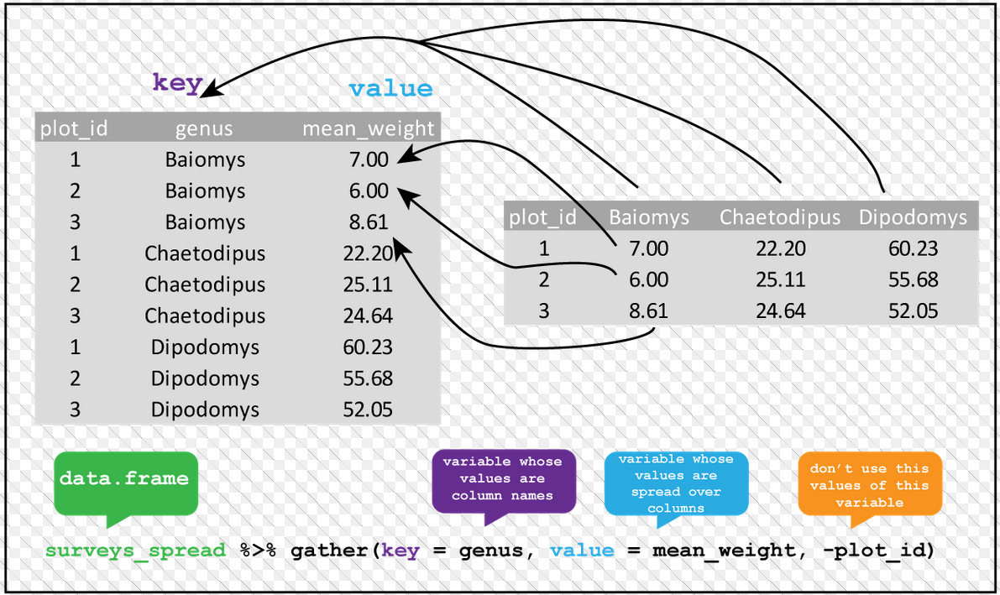
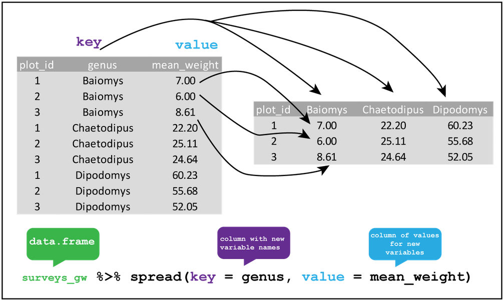

# Structurer ses tables

## Pourquoi se pencher sur la structuration des tables ?

Pour bien manipuler des données, leur structuration est fondamentale. Il faut bien savoir ce qu'est :

- Une ligne de notre table.
- Une colonne de notre table.

Sur une table non aggrégée (un répertoire, une table d'enquête...), la structuration naturelle est une ligne par observation (un individu, une entreprise...), une colonne par variable (âge, taille...) sur cette observation. 

Mais dès qu'on aggrège une telle table pour construire des tables structurées par dimensions d'analyse et indicateurs, se pose toujours la question de savoir ce qu'on va considérer comme des dimensions et comme des indicateurs. 

La bonne réponse, c'est que ça dépend de ce que l'on veut en faire.
L'important est de pouvoir facilement passer de l'un à l'autre suivant ce que l'on doit faire. C'est l'intérêt du module `{tidyr}`.

## Les deux fonctions clefs de `{tidyr}`


- `pivot.longer()` permet d'empiler plusieurs colonnes (correspondant à des variables quantitatives). Elles sont repérées par création d'une variable qualitative, à partir de leurs noms. Le résultat est une table au format *long*.

<center></center>

<center></center>

- `pivot.wider()` fait l'inverse. Cette fonction crée autant de colonnes qu'il y a de modalités d'une variable qualitative, en remplissant chacune par le contenu d'une variable numérique. Le résultat est une table au format *large*.

<center></center>

<center></center>

Un exemple : obtenir un fichier avec une ligne par région, et une colonne par année qui donne l'évolution en % de la construction neuve par rapport à l'année précédente

```{r, echo = TRUE, eval = TRUE}
sitadel_long <- read_excel("data/ROES_201702.xls", "AUT_REG") %>%
  mutate(ANNEE = str_sub(date, 1, 4)) %>%
  group_by(REG, ANNEE) %>%
  summarise(across(where(is.numeric), sum, na.rm = TRUE)) %>%
  mutate(across(is.numeric, list(EVO = ~ 100 * .x / lag (.x) - 100))) %>%
  select(REG, ANNEE, log_AUT_EVO) %>% 
  ungroup()

sitadel_large <- sitadel_long %>%
  pivot_wider(names_from = ANNEE, values_from = log_AUT_EVO, names_sep = "_")

sitadel_long2 <- sitadel_large %>% 
  pivot_longer(-REG, names_to = "annee", values_to = "log_aut_evo")
  
```

