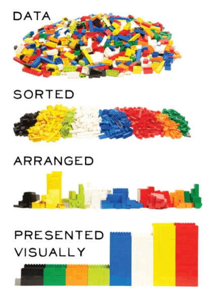
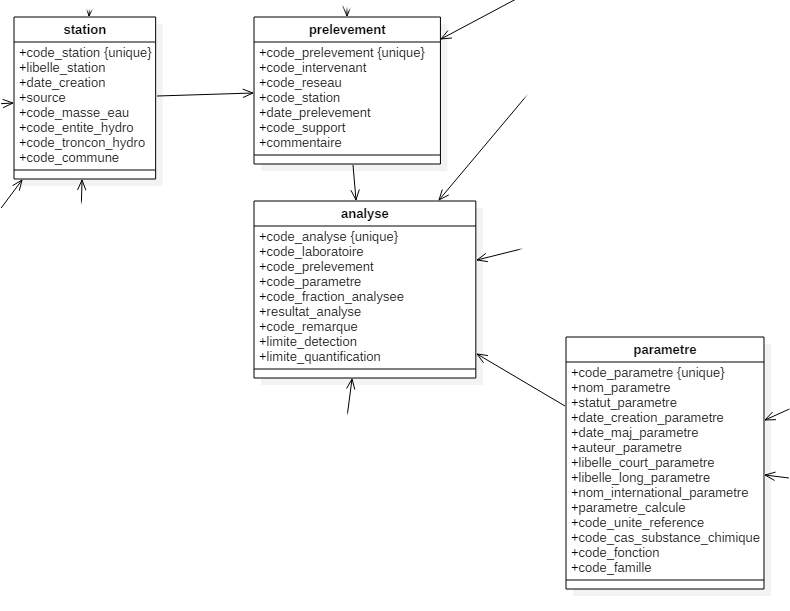
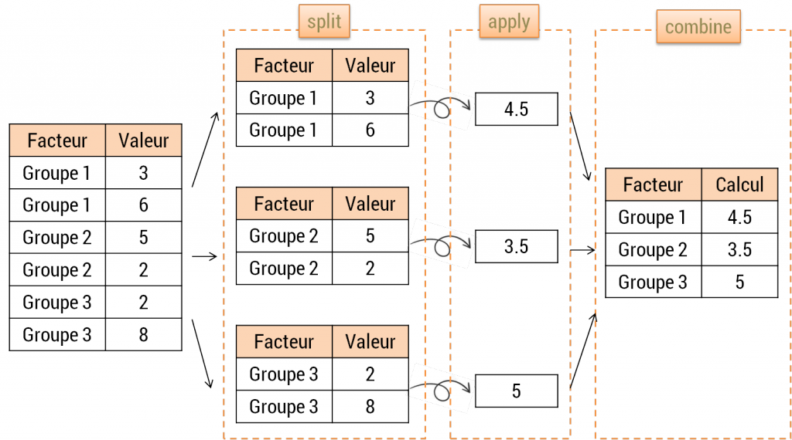
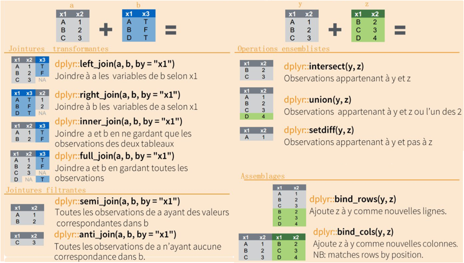

--- 
title: "Préparer ses données avec R et le Tidyverse"
author: "Maël Theulière & Bruno Terseur"
date: '`r format(Sys.time(), "%d %B %Y")`'
site: bookdown::bookdown_site
documentclass: book
bibliography: [book.bib, packages.bib]
biblio-style: apalike
link-citations: yes
description: "Préparation des données avec R et le Tidyverse (module 2)"
---

<style> 
  body {text-align: justify;}
</style>

```{r setup, include=FALSE}
rm(list=ls())
knitr::opts_chunk$set(echo = TRUE, message=FALSE, error=FALSE, warning=FALSE, fig.width=4, fig.height=4)
```

# Introduction


<font size="2"> 
*Crédit photographique Sébastien Colas*
</font> 

## Le parcours de formation

Ce dispositif de formation vise à faire monter en compétence les agents du MTES (Ministère de la transition écologique et solidaire) et du MCT (Ministère de la cohésion des territoires) dans le domaine de la science de la donnée avec le logiciel R. Il est conçu pour être déployé à l'échelle nationale par le réseau des CVRH (Centre de Valorisation des Ressources Humaines).

Le parcours proposé est structuré en modules de 2 jours chacun. Les deux premiers (ou un niveau équivalent) sont des pré-requis pour suivre les suivants qui sont proposés "à la carte" :

1. Socle : Premier programme en R
2. Socle : Préparation des données
3. Statistiques descriptives
4. Analyses multivariées
5. Datavisualisation : Produire des graphiques, des cartes et des tableaux
6. Documents reproductibles avec RMarkdown (2^ème^ semestre 2019)

... et en perspective : analyse spatiale, applis interactives avec Shiny, big data, etc.

La mise à disposition des supports de formation se fait désormais par la [page d'accueil du parcours de formation](https://mtes-mct.github.io/parcours-r/). Ces supports sont en [licence ouverte](https://www.etalab.gouv.fr/wp-content/uploads/2017/04/ETALAB-Licence-Ouverte-v2.0.pdf).

Si vous souhaitez accéder aux sources, données mobilisées pendant les formations, il faut directement les télécharger depuis le [Github du ministère](https://github.com/MTES-MCT/parcours_r_socle_preparation_des_donnees).

Un package d'exercices, [savoirfR](https://github.com/MTES-MCT/savoirfR) rassemble toutes les données et les consignes d'exercices de ce support de formation

Pour vous tenir au courant de l'offre de formation proposée par le réseau des CVRH, [consultez la plateforme OUPS](http://oups-cmvrh.e2.rie.gouv.fr/). Vous pouvez vous y abonner pour recevoir les annonces qui vous intéressent.

Il existe une liste pour diffuser de l'information, échanger autour de R ou lever des points de blocage. Pour s'insrire, envoyer un message vide avec le titre "subscribe labo.communaute-r" à l'adresse sympa@developpement-durable.gouv.fr.   

Il existe également un canal Ariane #utilisateurs_r et une faq http://pne.metier.e2.rie.gouv.fr/la-faq-de-r-r1028.html


## Objectifs du module 2

Ce module va vous permettre de découvrir un ensemble de méthodes sous R afin de préparer ses données. 
Préparer ses données sous R, cela veut dire : 

- Savoir les importer dans un environnement R,
- Mettre ses données dans de bons formats (date, catégorielle) et gérer les données manquantes,
- Rajouter des variables en fonction de variables existantes,
- Regrouper des modalités de variables,
- Joindre des tables entre elles pour obtenir des informations de plusieurs sources,
- Aggréger des données,
- Bien définir notre table de travail en fonction des indicateurs à analyser et à leurs dimensions d'analyse.
...

Bref, tout le travail technique préalable entre la collecte de la donnée et la valorisation proprement dite de ces sources.
On estime qu'un scientifique de la donnée passe en général ***la moitié de son temps*** à cela.



Sous R, comme souvent, il y a plusieurs façons d'aborder cette question. Ce module de formation privilègie l'exploration des packages du framework *tidyverse*, qui ont l'avantage d'aborder les différentes phases de préparation des données d'une façon intégrée et cohérente, que ce soit entre elles, ou avec d'autres.

<!--chapter:end:index.Rmd-->

# Le tidyverse

Le `tidyverse` est un ensemble de packages proposant une syntaxe cohérente pour remplir l'essentiel des traitements propres à la science de la données, de la lecture des données à la valorisation, en passant par la modélisation. Le manifeste du `tidyverse` comprend 4 principes clefs pour les packages : 

- Utiliser les structures de données existantes : ne pas créer des objets ad hoc ;

- Utiliser l'opérateur pipe ;

- S'intègrer dans l'approche de programmation fonctionnelle de R ;

- Designé pour les être humains : favoriser la facilité d'usage à la performance machine.


## Présentation des packages

### Des packages pour lire des données
#### tidyverse
- [readr](http://readr.tidyverse.org/) pour les fichiers plats
- [readxl](http://readxl.tidyverse.org/) pour les fichiers tableur Excel
- [haven](http://haven.tidyverse.org/) pour les données stockées sous des formats propriétaires (SAS, SPSS, ...)

#### Hors tidyverse
- [odbc](http://db.rstudio.com/odbc/) / [Rposgresql](https://cran.r-project.org/web/packages/RPostgreSQL/index.html)  pour accéder à des données stockées sous forme de base de données
- [sf](https://r-spatial.github.io/sf/) pour lire des données spatiales
- [rsdmx](https://github.com/opensdmx/rsdmx) pour lire des données sdmx

### Des packages pour manipuler des données
#### tidyverse
- [dplyr](http://dplyr.tidyverse.org/) fonctions correspondant à des "verbes" pour manipuler ses données
- [tidyr](http://tidyr.tidyverse.org/) fonctions pour  modifier l'agencement de nos tables entre les lignes et les colonnes

### Des packages pour nettoyer des données
#### tidyverse
- [forcats](http://forcats.tidyverse.org/) permet de manipuler les variables de type catégoriel (ou factor en R)
- [stringr](http://stringr.tidyverse.org/) permet de manipuler des chaînes de caractères
- [lubridate](http://lubridate.tidyverse.org/) permet de manipuler des dates

#### Hors tidyverse
- [stringi](http://www.gagolewski.com/software/stringi/) permet de manipuler des chaînes de caractères
- [RcppRoll](https://cran.r-project.org/web/packages/RcppRoll/index.html) qui regroupe des opérations fenêtrées ou glissantes


## Les spécificités du tidyverse

Quelques spécificités des fonctions de ce framework : 

- Ces packages sont orientés manipulation de *dataframes* et non de *vecteurs*   
- En conséquence, on utilise jamais l'indexation des colonnes de tables (le "$") pour appeler une variable   
- Chaque fonction ne fait qu'une chose et une seule (c'est une opération élémentaire)   
- L'ensemble des fonctions obéissent à la même logique, ce qui permet de simplifier l'apprentissage   
- L'ensemble de ces opérations élémentaires peuvent s'enchaîner à la manière d'un ETL avec le pipe  

## D'autres approches possibles 

Les fonctions que nous allons voir obéissent à une logique intégrée et simple, qui permet des manipulations complexes, à partir du moment ou l'on est capable d'identifier et de sérier chaque *opération élémentaire* à réaliser.  
D'autres packages permettent également de réaliser ce type de manipulations. La différence est qu'ils sont souvent dédiés à une tâche spécifique, ce qui rend la cohérence moins évidente lorsque l'on doit réaliser plusieurs opérations.   
Un autre package propose toutefois une vision intégrée de la sorte : [data.table](https://cran.r-project.org/web/packages/data.table/vignettes/datatable-intro.html).
Plusieurs différences sont à noter : 

- *data.table* est plus rapide sur d'importants volumes de données, le code est très succinct.  
- *dplyr* est plus simple à apprendre, le code est plus lisible, il peut s'appliquer à des formats de données multiples, il s'intègre dans un framework global qui va de la lecture des données (*readr*, *readxl*, *haven...*) à leur valorisation (*ggplot2*).  

<!--chapter:end:02-presentation_tidyverse.Rmd-->

# Bien commencer


## Créer un projet sous Rstudio pour vous permettre de recencer vos travaux.

Pourquoi travailler avec les projets Rstudio plutôt que les scripts R ?

- Cela permet la portabilité : le répertoire de travail par défaut d'un projet est le répertoire où est ce projet. Si vous transmettez celui-ci à un collègue, le fait de lancer un programme ne dépend pas de l'arborescence de votre machine.

> **Fini les `setwd("chemin/qui/marche/uniquement/sur/mon/poste")` !** 

- Toujours sur la portabilité, un projet peut être utilisé avec un outil comme `packrat` qui va vous intégrer en interne au projet l'ensemble des packages nécessaires au projet. Cela permet donc à votre collègue à qui vous passez votre projet de ne pas avoir à les installer et, surtout, si vous mettez à jour votre environnement R, votre projet restera toujours avec les versions des packages avec lesquelles vous avez fait tourner votre projet à l'époque. Cela évite d'avoir à subir les effets d'une mise à jour importante d'un package qui casserait votre code.

Pour activer `packrat` sur un projet, aller dans `Tools/Project Options->Packrat`

[En savoir plus sur Packrat](https://www.rstudio.com/resources/webinars/managing-package-dependencies-in-r-with-packrat/)

{#id .class width=500}


- Cela permet de se forcer à travailler en mode projet : on intègre à un seul endroit tout ce qui est lié à un projet : données brutes, données retravaillées, scripts, illustrations, documentations, publications... et donc y compris les packages avec `packrat`.

- On peut travailler sur plusieurs projets en même temps, Rstudio ouvre autant de sessions que de projets dans ce cas.

- Les projets Rstudio intègrent une interface avec les outils de gestion de version Git et SVN. Cela veut dire que vous pouvez versionner votre projet et l'héberger simplement comme répertoire sur des plateformes de gestion de code telle que Github ou Gitlab.

**Pour créer un projet : **

- Cliquez sur *Project* en haut à droite puis *New Project*.

{#id .class width=500}

- Cliquez sur *New Directory*.

{#id .class width=500}


## Intégrer vos données

Une bonne pratique est de créer un sous répertoire `/data` pour stocker les données sur lesquelles vous aurez à travailler. 

Vous pouvez le faire depuis l'explorateur de fichier de votre système d'exploitation ou directement à partir de l'explorateur de fichier de RStudio.

{#id .class width=500}

Cela marche bien quand on a un seul type de données, mais en général on va avoir à travailler sur des données brutes que l'on va retravailler ensuite et vouloir stocker à part. Si par la suite vous souhaitez avoir des exemples de bonnes pratiques sur comment structurer vos données, vous pouvez vous référer au [chapitre data](http://r-pkgs.had.co.nz/data.html) du livre d'Hadley Wickham sur la construction de packages R (tout package R étant aussi un projet !).

## Créer votre arborescence de projet

- Créer un répertoire `/src` ou vous mettrez vos scripts R.
- Créer un répertoire `/figures` ou vous mettrez vos illustrations issues de R.

## Activer les packages nécessaires

Commencer par rajouter un script dans le répertoire `/src` à votre projet qui commencera par : 

- activer l'ensemble des packages nécessaires,

- charger les données dont vous aurez besoin.


```{r lib, eval=TRUE, message=FALSE, warning=FALSE}

library(tidyverse)
library(lubridate)
library(RcppRoll)
library(DT)
library(readxl)
library(dbplyr)
library(RPostgreSQL)
library(rsdmx)
library(sf)
library(stringi)

sitadel <- read_excel("data/ROES_201702.xls", sheet = "AUT_REG",
                      col_types = c ("text","text","numeric","numeric","numeric","numeric"))
load(file = "data/FormationPreparationDesDonnees.RData")

```


## Bien structurer ses projets data

Plusieurs documents peuvent vous inspirer sur la structuration de vos projets data par la suite.

En voici quelques-uns : 

- https://github.com/pavopax/new-project-template
- https://nicercode.github.io/blog/2013-04-05-projects/
- https://www.inwt-statistics.com/read-blog/a-meaningful-file-structure-for-r-projects.html
- http://projecttemplate.net/architecture.html

À partir du moment où quelques grands principes sont respectés (un répertoire pour les données brutes en lecture seule par exemple), le reste est surtout une question d'attirance plus forte pour l'une ou l'autre solution. L'important est de vous tenir ensuite à conserver toujours la même arborescence dans vos projets afin de vous y retrouver plus simplement.


<!--chapter:end:03-get_started.Rmd-->

# Lire des données

## readxl : lire des données Excel 
La fonction `read_excel()` permet d'importer les données d'un fichier Excel. On peut spécifier : 

- la feuille, les colonnes, les lignes ou la zone à importer,  
- les lignes à supprimer avant importation,  
- si on souhaite importer la première ligne comme des noms de variables ou non,  
- le format des variables importées,  
- la valeur qui sera interprétée comme étant la valeur manquante.

```{r lire_1}
library(readxl)
sitadel <- read_excel("data/ROES_201702.xls", sheet = "AUT_REG",
                      col_types = c ("text","text","numeric","numeric","numeric","numeric"))
datatable(sitadel)
```

## read_delim : lire des fichiers plats 

La fonction `read_delim()` permet d'importer les données d'un fichier csv. Elle fonctionne de la même façon que `read_excel()`. On peut spécifier : 

- le délimiteur de colonne,  
- les lignes à supprimer avant importation,  
- si on souhaite importer la première ligne comme des noms de variables ou non,  
- le `locale` du fichier,  
- la valeur qui sera interprétée comme étant la valeur manquante.

`read_csv()`, `read_csv2()` et `read_tsv()` sont des implémentations prérenseignées de `read_delim` pour lire des fichiers plats avec séparateurs **,** **;** et **tabulaire**.

## Télécharger des données disponibles sur le web

Parfois, les données que nous exploitons sont disponibles sur le web.
Il est possible, directement depuis R, de télécharger ces données et, si nécessaire, de les décompresser (dans le répertoire de travail).
Exemple sur les données SEQUOIA de l'ACOSS :

```{r lire_2, eval=FALSE}
url <- "http://www.acoss.fr/files/Donnees_statistiques/SEQUOIA_TRIM_REGION.zip"
download.file(url, destfile = "data/SEQUOIA_TRIM_REGION.zip", method = "auto")
unzip(zipfile = "data/SEQUOIA_TRIM_REGION.zip", exdir = "data")
SEQUOIA <- read_excel("data/SEQUOIA_TRIM_REGION_BRUT.xlsx", sheet = "PAYS_DE_LA_LOIRE")
datatable(SEQUOIA)
```

## Lire des fichiers avec une dimension spatiale

Le package `sf` (pour simple feature) permet d'importer dans R un fichier ayant une dimension spatiale. Après importation, le fichier est un dataframe avec une variable d'un type nouveau : la géométrie. Deux exemples ici pour lire des données au format shape et geojson.

```{r lire_3, eval = FALSE, message = FALSE, warning = FALSE}
Carte_EPCI_France <- st_read(dsn = "data/refgeo2017", layer = "Contour_epci_2017_region")
plot(Carte_EPCI_France)

communes2017 <- st_read(dsn = "data/refgeo2017/communes2017.geojson")
plot(communes2017)
```

Le package `sf` contient l'ensemble des fonctions permettant des manipulations sur fichiers géomatiques.
On ne traitera pas ici de toutes ces fonctions en détail, se référer pour cela à la [documentation du package](https://r-spatial.github.io/sf/).

A noter que `sf` étant complètement compatible avec les packages du `tidyverse`, la géométrie se conçoit comme une une donnée comme une autre, sur laquelle par exemple on peut réaliser des aggrégations.


## Lire des données sous PostgreSQL

Deux approches possibles pour utiliser des données stockées dans une base de données PostgreSQL. 

- *Importer* toutes ces données dans l'environnement R
- se *connecter* à ces données et utiliser un interpréteur permettant de traduire du code R comme une requête SQL. 

### Lire des données sous PostgreSQL : première approche

```{r lire_4, eval=FALSE}
#Définition du driver
drv <- dbDriver("PostgreSQL") 

#Définition de la base de données
con <- dbConnect(drv, dbname = "dbname", host = "ip", port = numero_du_port,
                  user = "user_name", password = "pwd") 

#Spécification de l'encodage, obligatoire avec Windows
postgresqlpqExec(con, "SET client_encoding = 'windows-1252'") 

#Téléchargement de la table analyse du schéma pesticide
parametre <- dbGetQuery(con, "SELECT * FROM pesticides.parametre") 

#Téléchargement de données avec dimension spatiale via la fonction st_read du package simple feature
station = st_read(con, query = "SELECT * FROM pesticides.station")
```

On voit que pour importer notre table analyse, on a simplement lancé une requête SQL.
On peut bien sûr avec la même fonction lancer n'importe quelle requête sur la base et recueillir le résultat.

### Lire des données sous PostgreSQL : seconde approche

```{r lire_5, eval=FALSE, message=FALSE, warning=FALSE}
#définition du driver
drv <- dbDriver("PostgreSQL") 

#définition de la base de données
con <- dbConnect(drv, dbname = "dbname", host = "ip", port = numero_du_port, 
                 user = "user_name", password = "pwd") 

#spécification de l'encodage, obligatoire avec windows
postgresqlpqExec(con, "SET client_encoding = 'windows-1252'") 

#téléchargement de la table analyse du schéma pesticide
analyse_db <- tbl(con, in_schema ("pesticides", "analyse"))
```

Ici la table *analyse* n'est pas chargée dans l'environnement R, R s'est juste *connecté* à la base de données.

On peut réaliser des opérations sur la table *analyse* avec du code R très simplement. Par exemple pour filtrer sur les analyses relatives au Glyphosate : 

```{r lire_6, eval=FALSE, message=FALSE, warning=FALSE}
analyse_db <- filter(analyse_db, code_parametre == 1506)
```

>Attention, ce code ne touche pas la base de donnée, il n'est pas exécuté.
>Pour l'exécuter, il faut par exemple afficher la table.

```{r lire_7, eval = FALSE}
analyse_db
```

Même une fois le code exécuté, cette base n'est pas encore un dataframe.
Pour importer la table, on utilise la fonction `collect()`

```{r lire_8, eval = FALSE}
analyse_db <- collect(analyse_db)
```

Cette approche est à conseiller sur d'importantes bases de données, et sans dimension spatiale, car `dbplyr` ne sait pas encore lire ce type de variable (ce qui ne saurait tarder).

## Lire des données du webservice Insee

L'Insee met à disposition un webservice d'accès (API) à des données de référence sous le format [sdmx](https://sdmx.org/).
Le package [{rsdmx}](https://github.com/opensdmx/rsdmx) permet de se connecter directement à ces données. 
Deux approches sont possibles. La première permet d'accéder à une série particulière.

```{r lire_9, eval=FALSE}
url <- "https://bdm.insee.fr/series/sdmx/data/SERIES_BDM/001564471"
datainsee <- as.data.frame(readSDMX(url))
# Encoding(levels(datainsee$TITLE_FR)) <- "UTF-8"
```

Cette approche permet également de télécharger plusieurs séries en une seule requête. Par exemple : nous téléchargeons l'ensemble des données sur les créations et défaillances d'entreprises pour les secteurs de la construction et de l'immobilier sur les Pays de la Loire.

```{r lire_10, eval=FALSE}
url <- "https://bdm.insee.fr/series/sdmx/data/SERIES_BDM/001564471+001564503+001564799+001564823+001582441+001582578+001582597+001582745+001656155+001656161+001655989+001655995"
datainsee <- as.data.frame(readSDMX(url))
```

L'autre approche permet de télécharger un ensemble de données d'une thématique appelé *dataflow.* Ici, par exemple, on télécharge l'ensemble des données relatives à la construction neuve :

```{r lire_11, eval=FALSE}
url <- "https://bdm.insee.fr/series/sdmx/data/CONSTRUCTION-LOGEMENTS"
datainsee <- as.data.frame(readSDMX(url))
```

<!--chapter:end:04-lire_des_donnees.Rmd-->

# Manipuler des données

## Les principes des fonctions de `{dplyr}`

Le but de `{dplyr}` est d'identifier et de rassembler dans un seul package les outils de manipulation de données les plus importantes pour l'analyse des données. Ce package rassemble donc des fonctions correspondant à un ensemble d'opérations élémentaires (ou *verbes*) qui permettent de : 

- Sélectionner un ensemble de variables : `select()`  
- Sélectionner un ensemble de lignes : `filter()`  
- Ajouter/modifier/renommer des variables : `mutate()` ou `rename()`  
- Produire des statistiques aggrégées sur les dimensions d'une table : `summarise()`  
- Trier une table : `arrange()`  
- Manipuler plusieurs tables : `left_join()`, `right_join()`, `full_join()`, `inner_join()`...  

D'appliquer cela sur des données, quel que soit leur format : data frames, data.table, base de données sql, big data...

D'appliquer cela en articulation avec `group_by()` qui change la façon d'interpréter chaque fonction : d'une interprétation *globale* sur l'ensemble d'une table, on passe alors à une approche *groupe par groupe* : chaque groupe étant défini par un ensemble des modalités des variables définies dans l'instruction `group_by()`.

## Présentation des données

On va travailler sur ce module principalement à partir des données sitadel en date réelle estimée (permis de construire) et à partir des données de qualité des eaux de surface.




## Chargement des données

```{r manip_1, echo = FALSE, warning = FALSE, error = FALSE, eval = FALSE}
drv <- dbDriver("PostgreSQL")
con <- dbConnect(drv, dbname = "production", host = "xx.xx.xxx.xxx", port = 5432,
                 user = "dreal", password = "xxxxxxxx")
postgresqlpqExec(con, "SET client_encoding = 'windows-1252'")

analyse <- dbGetQuery(con, "SELECT * FROM pesticides.analyse")
parametre <- dbGetQuery(con, "SELECT * FROM pesticides.parametre")
prelevement <- dbGetQuery(con, "SELECT * FROM pesticides.prelevement")
station <- st_read_db(con, query = "SELECT * FROM pesticides.station")
```

```{r manip_2, include = TRUE}
load(file = "data/FormationPreparationDesDonnees.RData")
```

## Les verbes clefs de `{dplyr}` pour manipuler une table

### Sélectionner des variables : `select()`
<center></center>

Nous allons ici sélectionner un ensemble de variables de la table des prélèvements.

```{r manip_3, warning = FALSE}
prelevementb <- select(
  prelevement, date_prelevement, code_prelevement,
  code_reseau, code_station
)
datatable(prelevementb)

prelevementb <- select(prelevement, -commentaire)
names(prelevementb)
```

`select()` possède ce qu'on appelle des [helpers](https://dplyr.tidyverse.org/reference/select.html) qui permettent de gagner du temps dans l'écriture de notre select. A partir du moment où les conventions de nommage sont correctement effectuées, cela permet de gagner également en reproductibilité d'une année sur l'autre.

Exemple : sélectionner toutes les variables qui commencent par "code_" : 

```{r manip_4}
prelevementb <- select(prelevement, starts_with("code_"))
```

Exemple : sélectionner les variables dont les noms sont contenus dans un vecteur de chaînes de caractères :

```{r manip_5}
mes_variables <- c("code_prelevement", "code_intervenant", "code_reseau", "date_prelevement")
prelevementb <- select(prelevement, one_of(mes_variables))
```

### Trier une table : `arrange()`

```{r  manip_6}
prelevementb <- arrange(prelevementb, date_prelevement)
```

### Renommer une variable : `rename()`

```{r  manip_7}
prelevementb <- rename(prelevementb, date_p = date_prelevement)
```

On peut aussi directement renommer une variable dans l'opération `select()`

```{r  manip_8}
prelevementb <- select(prelevement, date_p = date_prelevement, code_prelevement,
                       code_reseau, code_station)
```

### Filtrer une table : `filter()`
<center></center>

On va ici récupérer les analyses produites par l'ARS

```{r filtrer}
ars <- filter(prelevement, code_reseau == "ARS")
```

L'exemple ci-dessus n'exerce un filtre que sur une condition unique.

Pour des conditions cumulatives (toutes les conditions doivent être remplies), le "&" ou la ","

```{r manip_9}
ars <- filter(prelevement, code_reseau == "ARS", code_intervenant == "44")
```

Pour des conditions non cumulatives (au moins une des conditions doit être remplie), le "|"

```{r manip_10}
ars <- filter(prelevement, code_reseau == "ARS" | code_reseau == "FREDON")
```

Si une condition non cumulative s'applique sur une même variable, privilégier un test de sélection dans une liste avec le `%in%`

```{r manip_11}
ars <- filter(prelevement, code_reseau %in% c("ARS", "FREDON"))
```

Pour sélectionner des observations qui ne répondent pas à la condition, le `!` (la négation d'un test)

Toutes les observations ayant été réalisées par un autre réseau que l'ARS :

```{r manip_12a}
non_ars <- filter(prelevement, code_reseau != "ARS")
```

Toutes les observations ayant été réalisées par un autre réseau que l'ARS ou FREDON :

```{r manip_12b}
ni_ars_ni_fredon <- filter(prelevement, !(code_reseau %in% c("ARS", "FREDON")))
```

### Modifier/ajouter une variable : `mutate()`

`mutate()` est le verbe qui permet la transformation d’une variable existante ou la création d’une nouvelle variable dans le jeu de données. 

<center></center>

Création de nouvelles variables : 
```{r manip_13}
prelevementb <- mutate(prelevementb,
  code_prelevement_caract = as.character(code_prelevement),
  code_reseau_fact = as.factor(code_reseau)
)
```

Modification de variables existantes :
```{r manip_14}
prelevementb <- mutate(prelevementb,
  code_prelevement = as.character(code_prelevement),
  code_reseau = as.factor(code_reseau)
)
```


`mutate()` possède une variante, `transmute()`, qui fonctionne de la même façon, mais ne conserve que les variables modifiées ou créées par le verbe.

### Extraire un vecteur : `pull()`

`pull()` permet d'extraire sous forme de vecteur une variable d'un *dataframe.*

```{r manip_15}
stations_de_la_table_prelevement <- pull(prelevement, code_station)
stations_de_la_table_prelevement <- unique(stations_de_la_table_prelevement)
```

## La boîte à outils pour créer et modifier des variables avec R

### Manipuler des variables numériques

Vous pouvez utiliser beaucoup de fonctions pour créer des variables avec `mutate()` :

- les opérations arithmétiques : `+`,`-`,`*`,`/`,`^` ;

- arithmétique modulaire : `%/%` (division entière) et `%%` (le reste), où x == y * (x %/% y) + (x %% y) ;

- logarithmes : `log()`, `log2()`, `log10()` ; 

- navigations entre les lignes : `lead()` et `lag()` qui permettent d'avoir accès à la valeur suivante et précédente d'une variable.

```{r, echo = TRUE, eval=TRUE}

a <- data.frame(x=sample(1:10))

b <- mutate(a, lagx = lag(x),
               leadx = lead(x),
               lag2x = lag(x, n = 2),
               lead2x = lead(x, n = 2))
b
```

- opérations cumulatives ou glissantes : 

    - R fournit des fonctions pour obtenir **opérations cumulatives** les somme, produit, minimum et maximum cumulés, dplyr fournit l'équivalent pour les moyennes : `cumsum()`, `cumprod()`, `cummin()`, `cummax()`, `cummean()`
  
    - Pour appliquer des **opérations glissantes**, on peut soit créer l'opération avec l'instruction `lag()`, soit exploiter le package `RcppRoll` qui permet d'exploiter des fonctions prédéfinies.

Exemple de somme glissante sur un pas de 2 observations.

```{r manip_16, eval=TRUE}

a <- data.frame(x=sample(1:10))

b <- mutate(a, cumsumx = cumsum(x),
               rollsumrx = roll_sumr(x, n=2))
               
b
```

Attention aux différences entre `roll_sum()` et `roll_sumr()`. Contrairement à `roll_sum()`, la fonction `roll_sumr()` fait en sorte d'obtenir un vecteur de même dimension que l'entrée :

```{r manip_17, eval=TRUE}
a$x
rollsumrx <- roll_sumr(a$x, n=2)
rollsumx <- roll_sum(a$x, n=2)
length(rollsumrx) == length(a$x)
length(rollsumx) == length(a$x)

```

Aussi dans le cadre d'opérations sur les dataframes, `roll_sum()` ne fonctionnera pas.

```{r manip_18, eval=FALSE}

b <- mutate(a, cumsumx = cumsum(x),
               rollsumx = roll_sum(x, n=2))

```


- Comparaisons logiques : *<*, *<=*, *>*, *>=*, *!=*

- Rangs : `min_rank()` devrait être la plus utile, il existe aussi notamment `row_number()`, `dense_rank()`, `percent_rank()`, `cume_dist()`, `ntile()`.

- `coalesce(x, y)` : permet de remplacer les valeurs manquantes de x par celle de y

- `variable = ifelse(condition(x), valeursi, valeursinon)` permet d'affecter *valeursi* ou  *valeursinon* à *variable* en fonction du fait que *x* répond à *condition*.
Exemple : création d'une variable résultat pour savoir si les résultats de nos analyses sont bons, ou non.

```{r manip_19}
analyseb <- mutate(analyse, resultat_ok = ifelse(code_remarque %in% c(1, 2, 7, 10),
                                                 yes = TRUE, no = FALSE))
```

qui peut se résumer, lorsque `yes=TRUE` et `no=FALSE`, à :
```{r manip_19b}
analyseb <- mutate(analyse, resultat_ok = code_remarque %in% c(1, 2, 7, 10))
```


- `case_when()` permet d'étendre la logique de `ifelse()` à des cas plus complexes.
Les conditions mises dans un `case_when()` ne sont pas exclusives. De ce fait, il faut pouvoir déterminer l'ordre d'évaluation des conditions qui y sont posées. Cet ordre s'effectue de bas en haut, c'est à dire que la dernière condition évaluée (celle qui primera sur toutes les autres) sera la première à écrire.
Exemple: On va ici calculer des seuils fictifs sur les analyses.

```{r manip_20}
analyseb <- mutate(analyse, classe_resultat_analyse = case_when(
  resultat_analyse == 0     ~ "1",
  resultat_analyse <= 0.001 ~ "2",
  resultat_analyse <= 0.01  ~ "3",
  resultat_analyse <= 0.1   ~ "4",
  resultat_analyse > 0.1    ~ "5",
  TRUE                      ~ ""
  ))
```

### Exercice 1 : Les données mensuelles sitadel

cf. package d'exercices `{savoirfR}`

À partir du fichier sitadel de février 2017 (ROES_201702.xls), produire un dataframe `sit_52_ind` contenant pour la **région Pays-de-la-Loire** (code région 52), pour **chaque mois** et pour les **logements individuels** (definis par la somme des logements individuels purs et individuels groupés : `i_AUT = ip_AUT + ig_AUT`) :  

   - le cumul des autorisations sur 12 mois glissants (`i_AUT_cum12`) ;    
   
   - le taux d’évolution du cumul sur 12 mois (`i_AUT_cum_evo`, en %) ;   
   
   - la part de ce cumul dans celui de l’ensemble des logements autorisés (`log_AUT`, en %).    
   
   
<center></center>


### Manipuler des dates

Parmi l'ensemble des manipulations de variables, celle des dates et des heures est toujours une affaire complexe.  
Le framework tidyverse propose le package `{lubridate}` qui permet de gérer ces informations de façon cohérente.

- gestion des dates :

```{r manip_22, echo = TRUE, eval = TRUE, results = 'hide'}

dmy("jeudi 21 novembre 2020")
dmy("21112020")
ymd("20201121")
```

- gestion des dates/heures : 

```{r, echo = TRUE, eval = TRUE, results = 'hide'}
dmy_hms("mardi 21 novembre 2020 9:30:00")
now()
```

- combien de jours avant Noël ?

```{r, echo = TRUE, eval = TRUE, results = 'hide'}

annee_en_cours <- year(today())

prochain_noel <- paste("25 décembre", annee_en_cours)
prochain_noel

dmy(prochain_noel) - today()
```

- le jour de la semaine d'une date : 

```{r, echo = TRUE, eval = TRUE, results = 'hide'}
wday(dmy("19012038"), label = TRUE)
```

Les fonctions `make_date()` et `make_datetime()` vous permettent de transformer un ensemble de variables en un format date ou date - heure. C'est par exemple utile lorsque l'on a des variables séparées pour l'année, le mois et le jour.

#### Exercice 2 : les dates

Convertir les colonnes de la table exercice au format date (quand c'est pertinent).

### Manipuler des chaînes de caractères

Le package `{stringr}` compile l'ensemble des fonctions de manipulation de chaînes de caractère utiles sur ce type de données.

On peut diviser les manipulations de chaînes de caractères en 4 catégories : 

- manipulations des caractères eux-mêmes,  
- gestion des espaces,  
- opérations liées à la langue,  
- manipulations de "pattern", notamment des expressions régulières.

#### Manipulations sur les caractères

Obtenir la longueur d'une chaîne avec `str_length()` :

```{r}
library(stringr)
str_length("abc")
```

Extraire une chaîne de caractères avec `str_sub()`  

`str_sub()` prend 3 arguments : une chaîne de caractère, une position de début, une position de fin.
Les positions peuvent être positives, et dans ce cas, on compte à partir de la gauche, ou négatives, et dans ce cas on compte à partir de la droite.

```{r}
a <- data.frame(x = c(" libeatg", "delivo y"))
b <- mutate(a, pos3a4 = str_sub(string = x, start = 3, end = 4),
               pos3a2avtlafin = str_sub(string = x, start = 3, end = -2))
b
```

`str_sub()` peut être utilisé pour remplacer un caractère

```{r}
str_sub(a$x, start = 6, end = 9) <-"rer"
a$x

```

Si on souhaite réaliser ce genre d'opération dans le cadre d'un `mutate`, il faut utiliser 
une fonction dite "pipe-operator-friendly", par exemple `stri_sub_replace()` du package `{stringi}`

```{r}
# install.packages("stringi")
library(stringi)

a <- data.frame(x = c(" libeatg", "delivo y"))
mutate(a, y=stri_sub_replace(str=x, from=6, to=9, value = "rer"))
```


#### Gestion des espaces

La fonction `str_pad()` permet de compléter une chaîne de caractère pour qu'elle atteigne une taille fixe. Le cas typique d'usage est la gestion des codes communes Insee.

```{r}
code_insee <- 1001
str_pad(code_insee, 5, pad = "0")
```

On peut choisir de compléter à gauche, à droite, et on peut choisir le "pad". Par défaut, celui-ci est l'espace.

La fonction inverse de `str_pad()` est `str_trim()` qui permet de supprimer les espaces aux extrémités de notre chaîne de caractères.

```{r}
proust <- "   Les paradoxes d'aujourd'hui sont les préjugés de demain.  "
str_trim(proust)
str_trim(proust, side = "left")
```

Les **expressions régulières** permettent la détection de "patterns" sur des chaînes de caractères. Par exemple "^" sert à indiquer que la chaîne de caractère recherchée doit se trouver au début de la chaîne examinée. Au contraire, "$" sert à indiquer que la chaîne de caractère recherchée doit se trouver à la fin.


```{r}

a <- data.frame(txt = c("vélo", "train", "voilier", "bus", "avion", "tram", "trottinette"))

b <- mutate(a, tr_au_debut = str_detect(string = txt, pattern = "^tr"))
b
filter(b, tr_au_debut)

filter(a, str_detect(string = txt, pattern = "n$"))

```


#### Opérations liées à la langue

Ces différentes fonctions ne donneront pas le même résultat en fonction de la langue par défaut utilisée.
La gestion des majuscules/minuscules :

```{r}
proust <- "Les paradoxes d'aujourd'hui sont LES préjugés de Demain."
str_to_upper(proust)
str_to_lower(proust)
str_to_title(proust)
```

La gestion de l'ordre, `str_sort()` et `str_order()` : 

```{r}
a <- data.frame(x = c("y", "i", "k"))

mutate(a, en_ordre = str_sort(x), 
          selon_position = str_order(x))

```

Suppression des accents (base::iconv) : 

```{r}
proust2 <- "Les paradoxes d'aujourd'hui sont les préjugés de demain ; et ça c'est embêtant"
iconv(proust2, to = "ASCII//TRANSLIT")

```

Avec un humour quelque peu discutable, un petit aide-mémoire illustré, assez visuel, est proposé par Lise Vaudor [ici](http://perso.ens-lyon.fr/lise.vaudor/manipuler-des-strings-avec-r/). 

### Manipuler des variables factorielles ( = qualitatives ou catégorielles)

Les facteurs (ou factors, an anglais) sont un type de vecteur géré nativement par R qui permettent de gérer les variables qualitatives ou catégorielles. Les facteurs sont souvent mis en regard des données labellisées utilisées dans d’autres logiciels statistiques. Les facteurs possèdent un attribut appelé niveaux (levels, en anglais) qui contient l'ensemble des valeurs qui peuvent être prises par les éléments du vecteur.

Les fonctions du module [`{forcats}`](https://cran.r-project.org/web/packages/forcats/forcats.pdf) permettent de modifier les modalités d'une variable factorielle, notamment : 

- changer les modalités des facteurs et/ou leur ordre,

- regrouper des modalités.

On va ici utiliser la fonction `fct_infreq()`, pour modifier le tri des stations en fonction de leur fréquence d'apparition dans la table "prelevement".

```{r, echo = FALSE, warning = FALSE, results = 'hide'}
library (forcats)

prelevementb <- mutate(prelevement, code_station = factor(code_station))
head(levels(prelevementb$code_station))

prelevementb <- mutate(prelevementb, code_station = fct_infreq(code_station))
head(levels(prelevementb$code_station))
```

`{forcats}` permet beaucoup d'autres possibilités de tri : 

- tri manue des facteurs avec `fct_relevel()` ;

- en fonction de la valeur d'une autre variable avec `fct_reorder()`;

- en fonction de l'ordre d'apparition des modalités avec `fct_inorder()`.

Consulter la [documentation](https://forcats.tidyverse.org/articles/forcats.html) du package `{forcats}` pour voir toutes les possibilités très riches de ce module.

En quoi ces fonctions sont utiles ?

Elles permettent notamment : 

- lorsqu'on fait des graphiques, d'afficher les occurences les plus importantes d'abord ;

- de lier l'ordre d'une variable en fonction d'une autre (par exemple les code Insee des communes en fonction des régions).

Exemple : ordonner les modalités d'un facteur pour améliorer l'aspect d'un graphique

```{r, echo = TRUE}
library (ggplot2)
library (forcats)

data <- data.frame(num = c(1, 8, 4, 3, 6, 7, 5, 2, 11, 3),
                   cat = c(letters[1:10])) 

ggplot(data, aes(x = cat, num)) +
  geom_bar(stat = "identity") +
    xlab(label = "Facteur") + ylab(label = "Valeur")

ggplot(data, aes(x = fct_reorder(cat, -num), num)) +
  geom_bar (stat = "identity") +
  xlab(label = "Facteur ordonné") + ylab(label = "Valeur")
```


## Aggréger des données : `summarise()`

<center></center>

La fonction `summarise()` permet d'aggréger des données, en appliquant une fonction sur les variables pour construire une statistique sur les observations de la table.
`summarise()` est une fonction dite de “résumé”. À l’inverse de `mutate()`, quand une fonction summarise est appelée, elle retourne une seule information. La moyenne, la variance, l’effectif… sont des informations qui condensent la variable étudiée en une seule information.
<left></left><left></left>

La syntaxe de summarise est classique. Le resultat est un dataframe.

```{r, echo = TRUE, results='hide'}
summarise(exercice, 
          mesure_moyenne = mean(resultat_analyse, na.rm = T))
```

On peut calculer plusieurs statistiques sur une aggrégation

```{r, echo = TRUE, results='hide'}
summarise(exercice, 
          mesure_moyenne = mean(resultat_analyse, na.rm = T),
          mesure_total = sum(resultat_analyse, na.rm = T)
          )
```

### Quelques fonctions d'aggrégations utiles

- compter : *n()*
- sommer : *sum()*
- compter des valeurs non manquantes *sum(!is.na())*
- moyenne : *mean()*, moyenne pondérée : *weighted.mean()*
- écart-type : *sd()*
- médiane : *median()*, quantile : *quantile(.,quantile)*
- minimum : *min()*, maximum : *max()*
- position : *first()*, *nth(., position)*, *last()*


## Aggréger des données par dimension : `group_by()`

<center></center>

Summarise est utile, mais la plupart du temps, nous avons besoin non pas d'aggréger des données d'une table entière, mais de construire des aggrégations sur des sous-ensembles : par année, département...
La fonction `group_by()` va permettre *d'éclater* notre table en fonction de dimensions de celle-ci.

Ainsi, si on veut construire des statistiques agrégées non sur l'ensemble de la table, mais pour chacune des modalités d'une ou de plusieurs variables de la table. Il faut deux étapes :

- utiliser prélablement la fonction `group_by()` pour définir les variables sur lesquelles on souhaite aggréger les données,

- utiliser `summarise()` ou sur la table en sortie de l'étape précédente.

Découper un jeu de données pour réaliser des opérations sur chacun des sous-ensembles afin de les restituer ensuite de façon organisée est appelée stratégie du split – apply – combine schématiquement, c’est cette opération qui est réalisée par dplyr dès qu'un `group_by()` est introduit sur une table.

<center></center>

Exemple pour calculer les statistiques précédentes par mois : 

```{r, echo = TRUE}
exercice <- mutate(exercice, annee = year(date_prelevement))

paran <- group_by(exercice, annee)

summarise (paran, mesure_moyenne = mean(resultat_analyse, na.rm = T),
                  mesure_total = sum(resultat_analyse, na.rm = T))
```

Pour reprendre des traitements "table entière", il faut mettre fin au `group_by()` par un `ungroup()`

## Le pipe


Le pipe est la fonction qui va vous permettre d'écrire votre code de façon plus lisible pour vous et les utilisateurs.
Comment ?  
En se rapprochant de l'usage usuel en grammaire. 

`verbe(sujet,complement)` devient `sujet %>% verbe(complement)`

Quand on enchaîne plusieurs verbes, l'avantage devient encore plus évident : 

`verbe2(verbe1(sujet,complement1),complement2)` devient `sujet %>% verbe1(complement1) %>% verbe2(complement2)`

En reprenant l'exemple précédent, sans passer par les étapes intermédiaires, le code aurait cette tête :

```{r, echo = TRUE,eval=TRUE}
summarise (
  group_by (
    mutate (
      exercice,
      annee = year (date_prelevement)
            ),
      annee
            ), 
          mesure_moyenne = mean (resultat_analyse, na.rm = T),
          mesure_total = sum (resultat_analyse, na.rm = T)
          )
```

Avec l'utilisation du pipe (raccourci clavier `CTrl + Maj + M`), il devient : 

```{r, echo = TRUE,eval=TRUE}
exercice %>%
  mutate(annee = year(date_prelevement)) %>%
  group_by(annee) %>%
  summarise(mesure_moyenne = mean (resultat_analyse, na.rm = T),
            mesure_total = sum (resultat_analyse, na.rm = T))

```

## La magie des opérations groupées

L'opération `group_by()` que nous venons de voir est très utile pour les aggrégations, mais elle peut aussi servir pour créer des variables ou filtrer une table, puisque `group_by()` permet de traiter notre table en entrée comme *autant de tables séparées* par les modalités des variables de regroupement.


### Exercice 3

A partir des données “sitadel” (chargées dans l'exercice 1), effectuer les opérations suivantes en utilisant l’opérateur %>% :  

- effectuer les mêmes calculs que ceux réalisés sur la région 52, mais sur chacune des régions _--> à stocker dans 'sit_ind'_
  
- calculer les aggrégations par année civile pour chacune des régions, puis leur taux d’évolution d’une année sur l’autre, exemple : (val2015-val2014)/val2014 _--> à stocker dans 'sit_annuel'_


### Exercice 4

Sur les données "FormationPreparationDesDonnées.RData", table "exercice" : 

1. calculer le taux de quantification pour chaque molécule et chacune des année : chaque molécule est identifiée par son `code_parametre`, le taux de quantification est le nombre de fois qu'une molécule est retrouvée (`code_remarque` = 1) sur le nombre de fois où elle a été
cherchée (`code_remarque` = 1, 2, 7 ou 10). Pour cela :  

 - créer la variable “annee” ;  
 - créer la variable de comptage des présences pour chaque analyse (1=présent, 0=absent) ;  
 - créer la variable de comptage des recherches pour chaque analyse (1=recherchée, 0=non recherchée) ;  
 - pour chaque combinaison `annee` x `code_parametre`, calculer le taux de quantification.  
 
2. Trouver pour chaque station, sur l’année 2016, le prélèvement pour lequel la concentration cumulée, toutes substances confondues, est la plus élevée (~ le prélèvement le plus pollué). Pour cela :  

 - filtrer les concentrations quantifiées (`code_remarque`=1) et l’année 2016 ;  
 - sommer les concentrations (`resultat_analyse`) par combinaison `code_station` x `code_prelevement` ;  
 - ne conserver que le prélèvement avec le concentration maximale.  


<!-- ## Le travail en colonnes col_wise ? -->

## Les armes non conventionnelles de la préparation des donnéees

Nous venons de voir les principaux verbes de manipulation d'une table de dplyr. Ces verbes acquièrent encore plus de puissance quand ils sont appelés avec les fonctions `accross()` et/ou `where()`.

### Les select helpers

Repéter des opérations de nettoyage ou de typage sur les différentes variables d'un jeu de données peuvent s'avérer fastidieuses lorsque l'on a à écrire les opérations variable par variable.

La fonctions select() proposent cinq manières différentes de désigner les variables à sélectionner.
Nous avons vu la première et la plus courante, qui est de **nommer** les variables une à une. 
On peut également utiliser les `:` qui permettent de sélectionner une liste de variables consécutives. On peut également désigner les variables à sélectionner en fonction de leur **position** :

```{r select1}
select(exercice, code_analyse, code_laboratoire, code_prelevement, code_parametre,
       code_fraction_analysee, resultat_analyse, code_remarque) %>%
  names()

select(exercice, code_analyse:code_remarque) %>% names()
select(exercice, -c(code_analyse:code_remarque)) %>% names()

select(exercice, 1:7) %>% names()
select(exercice, -c(1:7)) %>% names()

```

Sélectionner les variables en fonction de leur position peut sembler séduisant, mais attention aux problèmes de reproductibilité que cela peut poser si le jeu de données en entrée bouge un peu entre deux millésimes.

On peut également sélectionner des variables selon des **conditions sur leur nom**. Par exemple, on peut selectionner les variables dont le nom commence par "date", ou se termine par "station", ou contient "prel" ou en fonction d'une expression régulière comme "m.n" (le nom contient un "m" suivi d'un caractère suivi d'un "n".

```{r select2}
select(exercice, starts_with("date")) %>% names()
select(exercice, ends_with("station")) %>% names()
select(exercice, contains("prel")) %>% names()
select(exercice, matches("m.n")) %>% names()
```

On peut également sélectionner des variables selon des **conditions sur leur type**. Par exemple, sélectionner toutes les variables numériques ou toutes les variables de type caractères.

```{r select3}
select(exercice, where(is.numeric)) %>% names
select(exercice, where(is.character)) %>% names
```
On peut enfin sélectionner des variables en **combinant** les moyens détaillés ci-avant et en recourant aux opérateurs boléens : `!` (negation), `&` (et), `|` (ou).

```{r select4}
select(exercice, 1:7 & starts_with("code")) %>% names()
select(exercice, starts_with("date") & !where(is.Date)) %>% names()
```

<!-- one_of et all_of ? -->


### Utiliser les select helpers avec les autres verbes du tidyverse

#### rename() et rename_with()
Lorsqu'on souhaite renommer les variable une à une, la fonction `rename()` fonctionne de la même manière que `select()` :     
` mon_df_renomme <- rename(mon_dataframe, nouveau_nom1 = ancien_nom1, nouveau_nom2 = ancien_nom2)`

Si l'on souhaite recourir aux select helpers, il faut utiliser `rename_with()`, avec la synthaxe `rename_with(.data= mon_df, .fn= ma_fonction_de_renommage, .cols= ma_selection_de_variable_a_renommer)`. Exemple avec la fonction toupper() qui passe les chaînes de caractères en majuscules.

```{r rename_with1}
rename_with(station, toupper, starts_with("code")) %>% names()

```

Si la fonction de renommage est plus complexe qu'un simple mot, il faut recourir au pronom `.x` et au `~` pour la définir. Exemple avec la fonction `str_sub()` de `{stringr}` vue précédemment :

```{r rename_with2}
rename_with(exercice, ~ str_sub(.x, start=5, end=str_length(.x)), 
            starts_with("code")) %>% names()

```

###  filter(), mutate(), group_by(), summarise(), arrange(), transmute()...  

Les autres verbes de `{dplyr}` ont besoin de la fonction `across()` pour fonctionner avec les select helpers. Comme pour rename_with(), les fonctions complexes sont à déclarer avec le ~ et le
le pronom .x. On peut en désigner plusieurs ou leur fournir un nom qui servira de suffixe aux noms des variables calculées, en passant la ou les fonctions dans une liste : `.fn=list(suffixe1=ma_fonction1, suffixe2=ma_fonction2)`.   

La syntaxe générale devient :   
```
monverbe(.data, across(mesvariables, malistedefonctions), 
                across(mesvariables2, malistedefonctions2))
```

```{r scoped variants}

filter(parametre, across(starts_with("date"), ~ .x > "2015-01-01"))

mutate(exercice, across(starts_with("code") & where(is.numeric), as.factor),
                 across(starts_with("date"), as.Date))

summarise(parametre, across(starts_with("code"), n_distinct))

group_by(prelevement, across(code_intervenant:code_station)) %>%
  summarise(across(everything(), list(nb = n_distinct)))


```


Exemple sur l'exercice sur les données sitadel.  

```{r, echo = TRUE, eval = TRUE}
sitadel <- read_excel("data/ROES_201702.xls", "AUT_REG") %>%
  group_by(REG) %>%
  mutate(across(where(is.numeric), list(cumul12 = ~ roll_sumr(.x, n = 12))),
         across(ends_with("cumul12"), list(evo = ~ 100 * .x / lag (.x, 12) - 100,
                                           part = ~ 100 *.x / log_AUT_cumul12)))
```


<!--chapter:end:05-manipuler_des_donnees.Rmd-->

# Manipuler plusieurs tables

Le package `{dplyr}` possède également plusieurs fonctions permettant de travailler sur deux tables.
On va pouvoir regrouper ces fonctions en plusieurs catégories de manipulations : 

- pour fusionner des informations de deux tables entre elles : jointures transformantes,  
- pour sélectionner des observations d'une table en fonction de celles présentes dans une autre table : jointures filtrantes,   
- pour traiter deux tables ayant les mêmes colonnes et sélectionner sur celles-ci des observations de l'une et l'autre : opérations ensemblistes,  
- des manipulations visant à additionner deux tables ensembles : assemblages.

<center></center>

## Exercice 5

- reconstituer le dataframe "exercice" à partir des données contenues dans les tables "analyse", "prelevement" et "station" (jointures)  


- calculer le nombre d’analyses réalisées sur des molécules (code_parametre) présentes dans le référentiel `parametre`   

- produire une liste des **code_parametre** associés à des analyses mais absents du référentiel     

- produire une table des analyses "orphelines", c'est-à-dire qui ne correspondent pas à un prélèvement  


<!--chapter:end:06-manipuler_plusieurs_tables.Rmd-->

# Structurer ses tables

## Pourquoi se pencher sur la structuration des tables ?

Pour bien manipuler des données, leur structuration est fondamentale. Il faut bien savoir ce qu'est :

- Une ligne de notre table.
- Une colonne de notre table.

Sur une table non aggrégée (un répertoire, une table d'enquête...), la structuration naturelle est une ligne par observation (un individu, une entreprise...), une colonne par variable (âge, taille...) sur cette observation. 

Mais dès qu'on aggrège une telle table pour construire des tables structurées par dimensions d'analyse et indicateurs, se pose toujours la question de savoir ce qu'on va considérer comme des dimensions et comme des indicateurs. Le standard *tidy data* définit 3 principes pour des données *propres* :  

- chaque variable est une colonne,  
- chaque observation est une ligne,  
- les unités d'observations différentes sont stockées dans des tables différentes.     

Le respect de ces règles va nous amener parfois à devoir changer la définition des lignes et colonnes de nos tables en entrée.

Ci-dessous un exemple simple : la population estimée par département et genre en 2019. Ce fichier est un extrait d'un tableur [mis à disposition par l'Insee](https://www.insee.fr/fr/statistiques/1893198).   

```{r tidyr_intr, paged.print=TRUE}
estim_pop <- read_excel('data/estim-pop-dep-sexe-gca-2019.xls')
estim_pop
```

En quoi ce fichier n'est pas *tidy* ?

On retrouve 4 variables dans notre fichier : le territoire, le genre, l'âge et la population, et nos colonnes ne correspondent pas à ces variables.

Quel serait la version *tidy* de notre fichier ?

```{r tidyr_intr_deux, echo=FALSE}
estim_pop_tidy <- read_excel('data/estim-pop-dep-sexe-gca-2019.xls') %>% 
  pivot_longer(-c(dep,lib_dep), names_pattern="(.*)_(.*)", names_to = c("genre", "age"), values_to = "nombre_individus")
```


```{r tidyr_intr_trois, echo=FALSE}
estim_pop_tidy
```


Comment passer facilement d'un format *non tidy* à un format *tidy* ? C'est là qu'intervient le package `{tidyr}`.

## Les deux fonctions clefs de `{tidyr}`


- `pivot.longer()` permet d'empiler plusieurs colonnes (correspondant à des variables quantitatives). Elles sont repérées par création d'une variable qualitative, à partir de leurs noms. Le résultat est une table au format *long*.

<center></center>


- `pivot.wider()` fait l'inverse. Cette fonction crée autant de colonnes qu'il y a de modalités d'une variable qualitative, en remplissant chacune par le contenu d'une variable numérique. Le résultat est une table au format *large*.

<center></center>

Pour avoir un apperçu illustré de ces fonctions, voir [cette animation](https://www.dropbox.com/s/a6o75zj443b2rv3/tidyr-longer-wider-modified.gif?dl=0)

Reprenons notre table Insee d'estimation de population. Comment faire pour passer cette table dans le format *tidy* ?

Première étape, retrouvons notre colonne `population`. Pour cela, il nous faut passer notre table au *format long*, grace à `pivot_longer()`.

```{r, echo = TRUE, eval = TRUE}
estim_pop_tidy <- read_excel('data/estim-pop-dep-sexe-gca-2019.xls') %>% 
  pivot_longer(-c(dep,lib_dep), values_to = "nombre_individus", names_to = "genre_age")
```

Si nous voulions retrouver le format *large*, nous pourrions utiliser `pivot_wider()`  

```{r}
estim_pop_nontidy <- estim_pop_tidy %>% 
  pivot_wider(names_from = genre_age, values_from = nombre_individus)
```

Nous n'avons pas encore retrouvé nos deux variables `genre` et `age`, mais une seule variable mélange les deux.
Pour cela, nous pouvons utiliser `separate()` du package `{tidyr}`.

```{r}
estim_pop_tidy <- estim_pop_tidy %>% 
  separate(genre_age, sep = "_", into = c("genre","age"))
```

Mais `pivot_longer()` permet d'aller encore plus loin en spécifiant sur nos colonnes un moyen de distinguer nos deux variables directement avec l'argument `names_sep`.

```{r}
estim_pop_tidy <- read_excel('data/estim-pop-dep-sexe-gca-2019.xls') %>% 
  pivot_longer(-c(dep, lib_dep), names_sep = "_", names_to = c("genre", "age"), 
               values_to = "nombre_individus")
```

Et `pivot_wider()` permet également d'utiliser deux variables pour définir les modalités à *convertir* en colonnes.

```{r}
estim_pop_nontidy <- estim_pop_tidy %>% 
  pivot_wider(names_from = c(genre,age), values_from = nombre_individus)
```


Vous retrouverez une introduction complète à `{tidyr}` dans un [article très bien fait](https://tidyr.tidyverse.org/articles/pivot.html) de la documentation du package (en anglais). 
`{tidyr}` permet également de transformer des données sous forme de listes en dataframe *tidy* très simplement.


<!--chapter:end:07-structurer_ses_tables.Rmd-->

# Exercice 6 : les données majic

A partir des tables fournies dans le fichier *majic.RData* issues des [fichiers fonciers](http://piece-jointe-carto.developpement-durable.gouv.fr/NAT004/DTerNP/html3/_ff_descriptif_tables_image.html#pnb10) et du recensement de la population, calculer un indicateur d’étalement urbain entre 2009 et 2014 à la commune et à l’epci sur la région Pays de la Loire. La méthode utilisée sera celle du CEREMA. On peut consulter le rapport [ici](https://www.cerema.fr/system/files/documents/2017/07/Rapport_final_SOeS_phase_2_v8_cle01f492.pdf).

Le référentiel des communes a changé sur la période, dans un seul sens : il y a eu des fusions.

La table *com2017* permet de rattacher toute commune ayant existé sur la région à sa commune de rattachement dans la carte communale 2017.

Les surfaces artificialisées se calculent comme cela à partir de la typologie d'occupation du sol de majic :

$SA=dcnt07+dcnt09+ dcnt10+dcnt11+dcnt12+dcnt13$

Deux indices à calculer : 

- un indice d’étalement urbain simple $I_e = \dfrac{Evolution\;de\;la\;surface\;artificialisée} {Evolution\;de\;la\;population}$

- un indice d’étalement urbain avancé en classes

<center></center>


<!--chapter:end:08-exercice.Rmd-->

# Aller plus loin 

Quelques références : 
  
- R for data science : http://r4ds.had.co.nz/transform.html
  
- {dplyr}, Introduction : https://dplyr.tidyverse.org/articles/dplyr.html

- {dplyr}, manipulation de deux tables : https://dplyr.tidyverse.org/articles/two-table.html

- {tidyr} : https://tidyr.tidyverse.org/

- {tidyr, fonctions pivot} : https://tidyr.tidyverse.org/articles/pivot.html


- Aide mémoire de Rstudio sur {dplyr} et {tidyr} (assez ancien) : https://www.rstudio.com/wp-content/uploads/2016/01/data-wrangling-french.pdf

- Si vous préférez vous mettre à data.table https://s3.amazonaws.com/assets.datacamp.com/img/blog/data+table+cheat+sheet.pdf


<!--chapter:end:09-aller_plus_loin.Rmd-->

