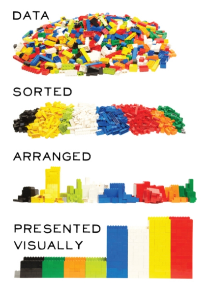

--- 
title: "Préparer ses données avec R et le Tidyverse"
author: "Maël Theulière & Bruno Terseur"
date: '`r format(Sys.time(), "%d %B %Y")`'
site: bookdown::bookdown_site
documentclass: book
bibliography: [book.bib, packages.bib]
biblio-style: apalike
link-citations: yes
description: "Préparation des données avec R et le Tidyverse (module 2)"
---

<style> 
  body {text-align: justify;}
</style>

```{r setup, include=FALSE}
rm(list=ls())
knitr::opts_chunk$set(echo = TRUE, message=FALSE, error=FALSE, warning=FALSE, dev = "svg", fig.width=6, fig.height=6)
library(savoirfR)
```

# Introduction


<font size="2"> 
*Crédit photographique Sébastien Colas*
</font> 

## Le parcours de formation

```{r collecte prez parcours, results='asis', warning=FALSE, echo=FALSE}
# Utilisation du chapitre de présentation du parcours présent dans https://github.com/MTES-MCT/parcours-r
cat(stringi::stri_read_lines("https://raw.githubusercontent.com/MTES-MCT/parcours-r/master/parties_communes/le_parcours_R.Rmd", encoding = "UTF-8"), sep = "\n")
```


## Le groupe de référents R du pôle ministériel

```{r collecte prez ref, warning=FALSE, echo=FALSE, results='asis'}
# Utilisation du chapitre de présentation des référents présent dans https://github.com/MTES-MCT/parcours-r
a <- knitr::knit_child(text = stringi::stri_read_lines("https://raw.githubusercontent.com/MTES-MCT/parcours-r/master/parties_communes/les_referents_R.Rmd", encoding = "UTF-8"), quiet = TRUE)
cat(a, sep = '\n')
```


## Objectifs du module 2

Ce module va vous permettre de découvrir un ensemble de méthodes sous R afin de préparer ses données. 
Préparer ses données sous R, cela veut dire : 

- Savoir les importer dans un environnement R,
- Mettre ses données dans de bons formats (date, catégorielle) et gérer les données manquantes,
- Rajouter des variables en fonction de variables existantes,
- Regrouper des modalités de variables,
- Joindre des tables entre elles pour obtenir des informations de plusieurs sources,
- Agréger des données,
- Bien définir notre table de travail en fonction des indicateurs à analyser et à leurs dimensions d'analyse.
...

Bref, tout le travail technique préalable entre la collecte de la donnée et sa valorisation proprement dite.
On estime qu'un scientifique de la donnée passe en général ***la moitié de son temps*** à cela.



Sous R, comme souvent, il y a plusieurs façons d'aborder cette question. Ce module de formation privilegie l'exploration des packages du framework *tidyverse*, qui ont l'avantage d'aborder les différentes phases de préparation des données d'une façon intégrée et cohérente, que ce soit entre elles, ou avec d'autres.
